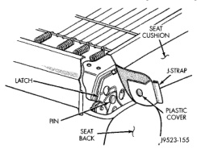
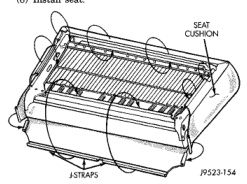
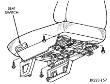

# REMOVAL AND INSTALLATION (Continued)

*Fig. 3 J-Strap Corner Removal/Installation]*

### BENCH SEAT BACK COVER

#### REMOVAL

(1) Remove seat back from vehicle.

(2) Disengage J-Straps from base of seat back.

(3) Remove hogrings, if equipped.

(4) With seat back in a normal vertical position, roll cover upwards and remove.

#### INSTALLATION

(1) With seat back in a normal vertical position, roll cover downwards over seat back.

(2) Install hogrings, if equipped.

(3) Secure J-Straps at base of seat back.

(4) Install seat back.

### BENCH SEAT CUSHION COVER

#### REMOVAL

(1) Remove seat from vehicle.

(2) Remove seat back.

(3) Position seat cushion on a suitable work surface with frame side up.

(4) Remove seat track.

(5) Remove left and right side J-Straps.

(6) Remove rear J-Strap.

(7) Remove front J-Strap.

(8) Roll trim cover off of front and rear corners and separate from foam cushion.

#### INSTALLATION

(1) Position cushion cover on cushion and roll cover over front and rear corners.

(2) Secure front J-Strap (Fig. 4).

(3) Install seat back.

(4) Secure rear J-Strap.

(5) Secure left and right side J-Straps.

(6) Verify stitching lines are straight, correct as necessary.

(7) Install seat track.

(8) Install seat.

*Fig. 4 J-Strap Installation]*

### SPLIT BENCH SEAT TRACK—STD CAB

#### REMOVAL

(1) Disconnect power seat switch connector, if equipped.

(2) Remove seat from vehicle.

(3) Remove bolts attaching center seat to seat frame and remove center seat.

(4) Remove bolts attaching seat track to seat frame (Fig. 5) and (Fig. 6).

*Fig. 5 Power Seat Track Removal/Installation]*

#### INSTALLATION

(1) Install bolts attaching seat track to seat frame. Tighten bolts to 25 N-m (18 ft. lbs.) torque.

(2) Install bolts attaching center seat to seat frame. Tighten bolts to 25 N-m (18 ft. lbs.) torque.

(3) Install seat.

(4) Connect power seat switch connector, if equipped.

---
*Chapter 23 Body, Page 12*
