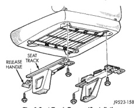
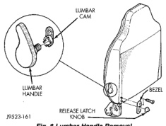
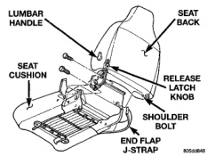

# REMOVAL AND INSTALLATION (Continued)

*Fig. 6 Seat Track Removal/Installation]*

(5) Power adjuster on power seat must be cycled in all 6 functions to ensure the adjuster is working properly.

### SPLIT BENCH SEAT BACK—STD CAB

#### REMOVAL

(1) Disconnect power seat switch connector, if equipped.

(2) Remove center seat/console armrest.

(3) Disconnect rear end flap J-Straps and peel back rear J-Strap.

(4) Remove bolts attaching seat back to seat cushion frame.

(5) Separate seat back from seat cushion (Fig. 7).

*Fig. 7 Seat Back Removal]*

#### INSTALLATION

(1) Align seat cushion with seat back and install shoulder bolt through seat back into seat cushion frame on inboard side. Tighten bolt to 49 N-m (36 ft.lbs.) torque.

(2) Install bolts through seat back latch into seat cushion frame. Tighten bolts to 25 N-m (18 ft.lbs.) torque.

(3) Connect rear end flap J-Straps and pull rear J-Strap up and secure to frame.

(4) Install seat in vehicle.

(5) Connect power seat switch connector, if equipped.

### SPLIT BENCH SEAT BACK COVER—STD CAB

#### REMOVAL

(1) Using a trim stick or equivalent tool, pry off lumbar handle, if equipped (Fig. 8). (Damage to lumbar handle may occur during removal, verify availability of replacement handle before removing.)

(2) Remove latch release knob (Fig. 8).

(3) Remove latch release bezel.

(4) Disengage J-Straps from base of seat back.

(5) Remove hogrings, if equipped.

(6) With seat back in a normal vertical position, roll cover upwards and remove.

*Fig. 8 Lumbar Handle Removal]*

#### INSTALLATION

(1) With seat back in a normal vertical position, roll cover downwards over seat back.

(2) Install hogrings, if equipped.

(3) Engage J-Straps at base of seat back.

(4) Align lumbar handle with lumbar cam and tap on with rubber mallet until seated.

(5) Install latch release bezel.

(6) Install latch release knob.

(7) Install seat back on seat cushion.

(8) Install seat.

---
*Chapter 23 Body, Page 13*
