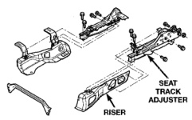
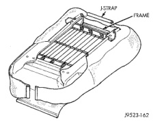

# REMOVAL AND INSTALLATION (Continued)

### SPLIT BENCH SEAT CUSHION COVER—STD CAB

#### REMOVAL

(1) Remove seat from vehicle.

(2) Remove center seat/console armrest.

(3) Remove seat tracks.

(4) Remove left and right J-straps.

(5) Remove seat back.

(6) Position seat cushion on a suitable work surface with frame side up.

(7) Remove rear J-strap.

(8) Remove front J-strap.

(9) Roll cushion cover off of foam cushion.

#### INSTALLATION

(1) Position cushion cover on cushion and roll cover over front and rear corners. Verify stitching lines are straight, correct as necessary.

(2) Pull front J-strap up, align cover to foam notches and secure front J-strap to frame (Fig. 9).

(3) Install seat back.

(4) Pull the left J-strap up and secure to frame. Verify cover is straight.

(5) Pull the right side J-strap up and secure to frame.

(6) Install seat tracks.

(7) Install seat.

*Fig. 9 J-Strap Installation]*

### FRONT SEAT RISER—QUAD CAB

#### REMOVAL

(1) Disconnect seat harness connector.

(2) Remove the seat from the vehicle.

(3) Remove the bolts attaching the seat track adjuster to the seat riser (Fig. 10).

(4) Separate the seat track adjuster from the riser.

*Fig. 10 Seat Riser]*

#### INSTALLATION

(1) Position the seat track adjuster on the riser.

(2) Install the bolts attaching the seat track adjuster to the seat riser. Tighten front bolts to 17 N-m (12 ft. lbs.) torque. Tighten rear inboard bolt to 22 N-m (16 ft. lbs.) torque. Tighten rear outboard bolt to 45 N-m (33 ft. lbs.) torque.

(3) Install the seat in the vehicle.

(4) Connect seat harness connector.

### FRONT SEAT TRACK ADJUSTER—QUAD CAB

#### REMOVAL

(1) Disconnect seat harness connector.

(2) Remove seat from vehicle.

(3) Remove bolts attaching center seat to seat frame and remove center seat.

(4) Disconnect seat belt control timer module harness connector (SCTM).

(5) Remove bolts attaching seat track adjuster to riser (Fig. 10).

(6) Remove bolts attaching seat track adjuster to seat frame.

#### INSTALLATION

(1) Install bolts attaching seat track adjuster to seat frame. Tighten recliner bolt to seat track adjuster to 45 N-m (33 ft. lbs.) torque. Tighten inboard and outboard pivot bolts to 51 N-m (37 ft. lbs.) torque.

(2) Install bolts attaching seat track adjuster to riser.

(3) Install center seat to seat frame.

(4) Connect seat belt control timer module harness connector (SCTM).

(5) Install seat in vehicle.

(6) Connect seat harness connector.

---
*Chapter 23 Body, Page 14*
