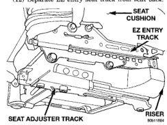

# REMOVAL AND INSTALLATION (Continued)

### EZ ENTRY SEAT TRACK—CLUB CAB

#### REMOVAL

(1) Remove front passenger seat.

(2) Remove recliner handle.

(3) Remove side shield.

(4) Disengage seat track latch release cables.

(5) Remove bolts attaching seat track/riser to EZ entry seat track (Fig. 11).

(6) Remove screws attaching EZ entry track to seat cushion frame.

(7) Remove nut attaching inboard seat belt buckle to EZ entry seat track.

(8) Remove nut attaching seat/shoulder belt to EZ entry seat track.

(9) Remove bolts attaching recliner/seat back to EZ entry seat track.

(10) Remove inboard seat back pivot bolt.

(11) Disengage latch release cable from pulley.

(12) Separate EZ entry seat track from seat back.

*Fig. 11 EZ Entry Seat Track]*

#### INSTALLATION

(1) Position inboard EZ entry seat track at seat back.

(2) Engage latch release cable around pulley.

(3) Install bolts attaching recliner/seat back to EZ entry seat track. Tighten bolts to 45 N-m (33 ft. lbs.) torque.

(4) Install inboard seat back pivot bolt. Tighten bolt to 50 N-m (36 ft. lbs.) torque.

(5) Install nut attaching inboard seat belt buckle to EZ entry seat track. Tighten nut to 45 N-m (33 ft. lbs.) torque.

(6) Install screws attaching EZ entry track to seat cushion frame. Tighten screws to 25 N-m (18 ft. lbs.) torque.

(7) Install bolts attaching seat track/riser to EZ entry seat track. Tighten front bolts to 17 N-m (12 ft. lbs.) torque. Tighten rear inboard bolts to 21 N-m (16 ft. lbs.) torque. Tighten rear outboard bolts to 45 N-m (33 ft. lbs.) torque.

(8) Engage seat track latch release cables.

(9) Install front passenger seat.

(10) Install nut attaching seat/shoulder belt to EZ entry seat track. Tighten nut to 45 N-m (33 ft. lbs.) torque.

(11) Install side shield.

(12) Install recliner handle.

### FRONT SEAT BACK—QUAD CAB

#### REMOVAL

(1) Remove screw attaching recliner handle and pull handle to remove.

(2) Remove seat dump handle, 2-door "BE" vehicles only.

(3) Remove screws attaching side shield to seat track adjuster.

(4) Remove seat dump handle.

(5) Pull shoulder belt out completely and clamp shoulder belt to prevent shoulder belt from retracting (Fig. 12).

(6) Remove shoulder belt anchor bolt.

(7) From the underside of the seat, remove the inboard pivot bolt (Fig. 13).

(8) From the underside of the seat, disengage the seat/shoulder belt harness connector.

**WARNING: DO NOT REMOVE UPPER RECLINER HANDLE, PULL ON UPPER RECLINER HANDLE OR RECLINER CABLE END. THE RECLINER LEAD SCREW IS SPRING LOADED AND WILL EJECT IF EITHER THE HANDLE OR CABLE IS PULLED BEFORE THE LEAD SCREW IS REMOVED.**

(9) Remove clip attaching recliner cable (Fig. 14) to seat track adjuster and separate the cable from the seat track adjuster.

(10) Remove the inboard and outboard pivot bolts attaching the frame to the seat track adjuster (Fig. 15).

(11) Remove recliner lower bolt.

(12) Separate seat back from seat track adjuster.

#### INSTALLATION

(1) Position seat back on seat track adjuster.

(2) Install the inboard and outboard pivot bolts attaching the frame to the seat track adjuster (Fig. 15).

(3) Install the bolt attaching the lower recliner to the seat track adjuster.

(4) Position the recliner cable on seat track adjuster and install new clip.

(5) From the underside of the seat, engage the seat/shoulder belt harness connector.

---
*Chapter 23 Body, Page 15*
