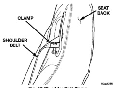
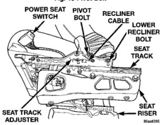
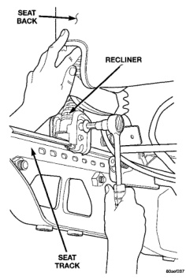
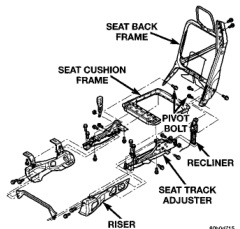

# REMOVAL AND INSTALLATION (Continued)

*Fig. 12 Shoulder Belt Clamp]*

*Fig. 13 Pivot Bolt]*

*Fig. 14 Recliner Cable]*

*Fig. 15 Recliner]*

#### INSTALLATION (Continued)

(6) Install shoulder belt anchor bolt. Tighten bolt to 45 N-m (33 ft. lbs.) torque.

(7) Remove clamp (Fig. 12).

(8) Install side shield.

(9) Install recliner handle.

(10) Install seat dump handle, if removed.

### FRONT SEAT RECLINER—QUAD CLUB

#### REMOVAL

(1) Remove seat back.

(2) Disengage J-straps at base of seat back and roll seat back cover upward to access rubber bellows push-in fasteners.

**NOTE:** Notice the routing of the recliner cable for installation.

(3) Remove the push-in fasteners attaching upper rubber bellows to the seat back frame.

(4) Remove rubber bellows.

(5) Remove seat dump handle, 2-door "BE" vehicles only.

---
*Chapter 23 Body, Page 16*
