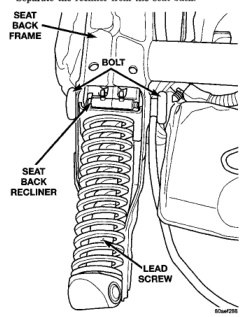
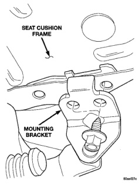

# REMOVAL AND INSTALLATION (Continued)

**WARNING:** Do not pull on upper recliner handle or recliner cable end. The recliner lead screw is spring loaded and will eject if either the handle or cable is pulled before the lead screw is removed.

(6) Remove the bolts attaching upper recliner to seat back frame (Fig. 16).

(7) Separate the recliner from the seat back.

*Fig. 16 Seat Back Recliner]*

#### INSTALLATION

(1) Install seat dump handle, if removed.

(2) Position the recliner in the seat back.

(3) Install the bolts attaching upper recliner to seat back frame (Fig. 16).

(4) Install rubber bellows.

(5) Roll seat back cover downward and engage J-straps at base of seat back.

(6) Ensure recliner cable is correctly routed.

(7) Install seat back.

### FRONT SEAT CUSHION—QUAD CAB

#### REMOVAL

The seat cushion can be removed with the seat in the vehicle.

(1) From the underside of the seat, remove the bolts attaching the cushion frame to the mounting brackets.

(2) Remove the cushion from the seat tracks.

#### INSTALLATION

(1) Position the cushion frame on the seat tracks.

(2) Ensure that the cushion frame is aligned with the mounting brackets (Fig. 17).

(3) Install the bolts attaching the seat cushion frame to the mounting brackets. Tighten bolts to 25 N-m (18 ft. lbs.) torque.

*Fig. 17 Seat Cushion Mounting Frame]*

### FRONT SEAT BACK COVER—QUAD CAB

#### REMOVAL

(1) Remove recliner handle.

(2) Remove dump handle, if equipped.

(3) Remove side shield.

(4) Clamp belt to prevent from retracting.

(5) Remove the bolt attaching the seat belt anchor to the seat track adjuster.

(6) Remove the assist handle on the backside of the seat, if equipped.

(7) Disengage the J-strap at the base of the seat back (Fig. 18).

(8) Roll cover upward.

(9) Disengage hog rings attaching the cover to the seat back frame (Fig. 19).

(10) Using a trim stick, carefully pry shoulder belt guide bezel from seat back.

(11) Route the shoulder belt and guide bezel through the seat back cover.

---
*Chapter 23 Body, Page 17*
