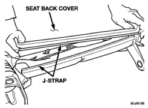
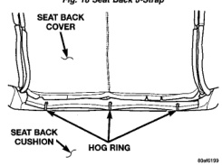
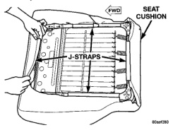
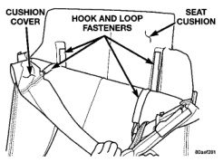

# BR BODY 23 - 18

## REMOVAL AND INSTALLATION (Continued)

(12) Roll the cover upward and separate from the seat back.

### SEAT BACK COVER

*Fig. 18 Seat Back J-Strap]*

*Fig. 19 Seat Back Hog Rings]*

### INSTALLATION

(1) Position the seat back cover on the seat back and roll the cover downward.

(2) Route the shoulder belt and guide bezel through the seat back cover.

(3) Engage hog rings attaching the cover to the seat back frame.

(4) Align the shoulder belt guide bezel and press into place.

(5) Roll cover downward.

(6) Engage the J-strap at the base of the seat back.

(7) Install the assist handle on the backside of the seat, if equipped.

(8) Install the bolt attaching the seat belt anchor to the seat track adjuster.

(9) Install side shield.

(10) Install dump handle, if equipped.

(11) Install recliner handle.

## FRONT SEAT CUSHION COVER—QUAD CAB

### REMOVAL

(1) Remove seat cushion.

(2) Disengage the J-straps attaching the cushion cover to the cushion frame (Fig. 20).

(3) Peel the cushion cover and disengage the hook and loop fasteners (Fig. 21).

(4) Disengage the hog rings attaching the cushion cover to the cushion frame (Fig. 22).

(5) Separate the cover from the cushion.

*Fig. 20 Seat Cushion J-Straps]*

*Fig. 21 Seat Cushion Cover Hook and Loop]*
