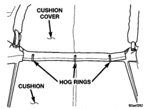

# BR BODY 23 - 19

## REMOVAL AND INSTALLATION (Continued)

*Fig. 22 Seat Cushion Cover Hog Rings]*

### INSTALLATION

(1) Position the cover on the cushion.

(2) Engage the hog rings attaching the cushion cover to the cushion frame.

(3) Engage the hook and loop fasteners.

(4) Engage the J-straps attaching the cushion cover to the cushion frame.

(5) Install seat cushion.
