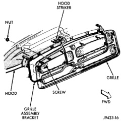

# BR BODY 23 - 21

## GENERAL INFORMATION

### INTERIOR TRIM PANELS

**CAUTION: Do not attempt to remove interior trim panels/mouldings without first removing the necessary adjacent panels.**

To avoid damaging the panels, ensure that all the screws and clips are removed before attempting to remove an interior trim panel/moulding. Trim panels are somewhat flexible but can be damaged if handled improperly.

## REMOVAL AND INSTALLATION

### GRILLE

#### REMOVAL

(1) Release primary hood latch.

(2) Release hood safety catch and open hood.

(3) Remove bolt holding bottom of grille to frame.

(4) Remove bolts holding sides of grille to frame.

(5) Remove nuts holding grille to hood (Fig. 1).

(6) Separate grille from vehicle.

#### INSTALLATION

Reverse the preceding operation.

### GRILLE FRAME

#### REMOVAL

(1) Release primary hood latch.

(2) Release hood safety catch and open hood.

(3) Remove bolts holding guide loop for hood safety catch release rod to grille frame.

(4) Remove grille.

(5) Remove screws holding grille frame to hood (Fig. 2).

(6) Separate grille frame from vehicle.

*Fig. 1 Grille]*

#### INSTALLATION

Reverse the preceding operation.

### HOOD

#### REMOVAL

(1) Release primary hood latch.

(2) Release hood safety catch and open hood.

(3) Disconnect the under hood lamp wire connector.

(4) Mark all bolt and hinge attachment locations with a grease pencil or other suitable device to provide reference marks for installation.
