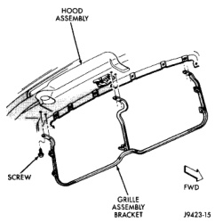
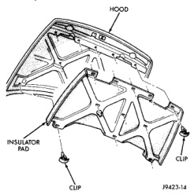
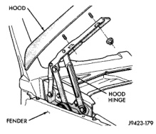

# BR BODY 23 - 22

## REMOVAL AND INSTALLATION (Continued)

*Fig. 2 Grille Mounting Frame]*

(5) Remove the top hood to hinge attaching bolts and loosen the bottom bolts until they can be removed by hand (Fig. 3).

(6) With assistance of a helper at the opposite side of the vehicle to support the hood, remove the bottom hood to hinge attaching bolts. Separate the hood from the vehicle.

*Fig. 3 Hood]*

#### INSTALLATION

Align all marks and secure bolts. The hood should be aligned to 5 mm (0.2 in.) gap to the front fenders and flush across the top surfaces along fenders.

Reverse the preceding operation.

### HOOD SILENCER

#### REMOVAL

(1) Release primary hood latch.

(2) Release hood safety catch and open hood.

(3) Remove push-in fasteners holding silencer to hood (Fig. 4).

(4) Separate hood silencer from vehicle.

*Fig. 4 Hood Silencer]*

#### INSTALLATION

Reverse the preceding operation.

### HOOD HINGE

#### REMOVAL

(1) Open hood and support the side that requires hinge replacement.

(2) Mark all bolt and hinge attachment locations with a grease pencil or other suitable device to provide reference marks for installation. When installing hood hinge, align all marks and secure bolts. The hood should be aligned to 5 mm (0.2 in.) gap to the front fenders and flush across the top surfaces along fenders. Shims can be added or removed under hood hinge to achieve proper hood height.

(3) Remove hood to hinge attaching bolts (Fig. 5).

(4) Remove hood hinge to cowl panel attaching bolts and separate hinge from vehicle.

#### INSTALLATION

Reverse the preceding operation. If necessary, paint new hinge before installation.
