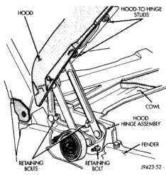
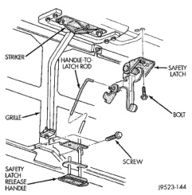

# BR BODY 23 - 23

## REMOVAL AND INSTALLATION (Continued)

*Fig. 5 Hood Hinge]*

### HOOD SAFETY CATCH

#### REMOVAL

(1) Release primary hood latch.

(2) Release hood safety catch and open hood.

(3) Remove bolts holding hood safety catch to hood (Fig. 6).

(4) Separate safety catch from vehicle.

*Fig. 6 Hood Safety Catch and Latch Striker]*

#### INSTALLATION

Reverse the preceding operation.

### HOOD LATCH STRIKER

#### REMOVAL

(1) Release primary hood latch.

(2) Release hood safety catch and open hood.

(3) Remove bolts holding hood latch striker to hood (Fig. 6).

(4) Separate hood latch striker from vehicle.

#### INSTALLATION

Reverse the preceding operation.

### HOOD LATCH

#### REMOVAL

(1) Release primary hood latch.

(2) Release hood safety catch and open hood.

(3) Remove bolts holding hood latch to radiator closure panel crossmember (Fig. 7).

(4) Separate hood latch from crossmember.

(5) Disconnect release cable from hood latch.

#### INSTALLATION

Reverse the preceding operation.

### HOOD RELEASE CABLE

#### REMOVAL

(1) Release primary hood latch.

(2) Release hood safety catch and open hood.

(3) Remove hood latch.

(4) Disconnect release cable from hood latch.

(5) Detach the release cable from the retainer clips in the engine compartment.

(6) Separate the release cable grommet from the dash panel hole.

(7) From the inside of the vehicle, remove the screws attaching the hood release handle to the bottom of the instrument panel.

(8) Pull/route the hood release cable through the dash panel hole and remove it via the inside of the vehicle.

#### INSTALLATION

**NOTE: If replacement hood latch is also being installed, ensure that it is thoroughly lubricated.**

(1) From inside the vehicle, pull/route the hood release cable through the dash panel hole and into the engine compartment.

(2) Install the hood release handle.

(3) Install the cable grommet in the dash panel hole.

(4) Attach the release cable to the retainer clips in the engine compartment.

(5) Attach release cable to hood latch.

(6) Install hood latch.
