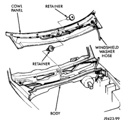
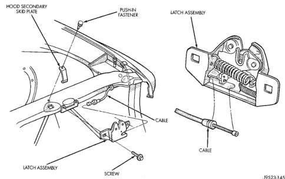

# BR BODY 23 - 24

## REMOVAL AND INSTALLATION (Continued)

*Fig. 7 Hood Latch]*

(7) Test the hood latch release cable for proper operation.

### COWL COVER

#### REMOVAL

(1) Release primary hood latch.

(2) Release hood safety catch and open hood.

(3) Remove wiper arms, refer to Group 8K, Windshield Wipers and Washers.

(4) Disconnect windshield washer tubing from coupling near left hood hinge.

(5) Remove retainers holding cowl cover to cowl box (Fig. 8).

(6) Pull cowl seal from pinch flange at front of cowl.

(7) Separate cowl cover from vehicle.

*Fig. 8 Cowl Cover]*

#### INSTALLATION

Reverse the preceding operation.

### FRONT WHEELHOUSE LINER

#### REMOVAL

(1) Hoist and support vehicle on safety stands.

(2) Remove front wheel.

(3) Remove plastic rivets holding wheelhouse liner to fender at the edge of wheel opening.

(4) Remove plastic rivets holding liner to the wheelhouse (Fig. 9).

(5) Separate front wheelhouse liner from vehicle.
