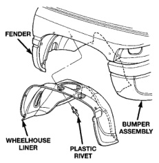
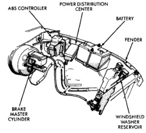
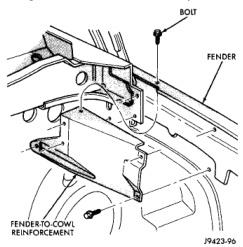

# BR BODY 23 - 25

## REMOVAL AND INSTALLATION (Continued)

*Fig. 9 Front Wheelhouse Liner]*

#### INSTALLATION

Reverse the preceding operation.

### LEFT FRONT FENDER

#### REMOVAL

(1) Release primary hood latch.

(2) Release hood safety catch and open hood.

(3) Remove front bumper, refer to Group 13, Bumpers and Frame for procedures.

(4) Remove air cleaner from wheelhouse (DIESEL ONLY).

(5) Remove coolant overflow bottle (V-10 ONLY).

(6) Remove battery and tray, refer to Group 8B, Battery/Starter/Generator Service for procedures.

(7) Remove screws holding power distribution center to left wheelhouse (Fig. 10).

(8) Disengage wire harness tie-downs from wheelhouse.

(9) Disconnect wiring harness to headlamp connector.

(10) Disconnect wiring harness to airbag sensor and remove airbag sensor from wheelhouse.

(11) Remove bolts holding anti-lock brake controller to wheelhouse (Fig. 10), if equipped. Refer to Group 5, Brakes for procedures.

(12) Disengage windshield washer tubing tie-downs from wheelhouse (Fig. 10).

(13) Remove bolts holding front fender to cowl reinforcement (Fig. 11).

(14) Remove bolts holding front fender to radiator closure panel (Fig. 12).

(15) Remove bolts holding bottom of front fender to rocker panel lower flange (Fig. 13).

(16) Open left door.

(17) Remove bolt holding front fender to hinge pillar mounting bracket (Fig. 13).

(18) Remove bolts holding top of fender to radiator closure panel (Fig. 13).

(19) Separate left front fender from vehicle.

*Fig. 10 Left Front Fender Access Components]*

*Fig. 11 Fender to Cowl Reinforcement—Typical]*
