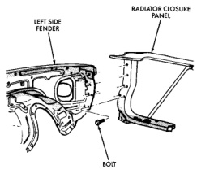
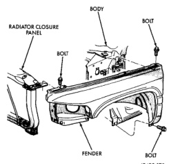
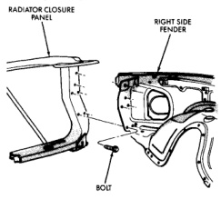

# BR BODY 23 - 26

## REMOVAL AND INSTALLATION (Continued)

*Fig. 12 Left Fender to Radiator Closure Panel Fasteners]*

*Fig. 13 Left Front Fender]*

#### INSTALLATION

Reverse the preceding operation.

### RIGHT FRONT FENDER

#### REMOVAL

(1) Remove front bumper, refer to Group 13, Bumpers and Frame for procedures.

(2) Remove auxiliary battery and tray on right side, if equipped. Refer to Group 8B, Battery/Starter/Generator Service for procedures.

(3) Disengage wire harness tie-downs from wheelhouse.

(4) Disconnect wiring harness to headlamp connector.

(5) Disconnect wiring harness to airbag sensor and remove airbag sensor from wheelhouse.

(6) Remove front wheelhouse liner (Fig. 9).

(7) Disengage air conditioning tubing from inner fender clips.

(8) Remove bolts holding front fender to cowl reinforcement (Fig. 11).

(9) Remove bolts holding front fender to radiator closure panel (Fig. 14).

(10) Remove bolts holding bottom of front fender to rocker panel lower flange (Fig. 15).

(11) Open right door.

(12) Remove bolt holding front fender to hinge pillar mounting bracket (Fig. 15).

(13) Remove bolts holding top of fender to radiator closure panel (Fig. 15).

(14) Separate right front fender from vehicle.

*Fig. 9 Right Fender to Radiator Closure Panel Fasteners]*

#### INSTALLATION

Reverse the preceding operation.

### EXTERIOR NAMEPLATES

#### REMOVAL

(1) Insert a plastic trim stick or a hard wood wedge behind the emblem to separate the adhesive
