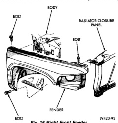
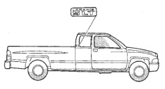
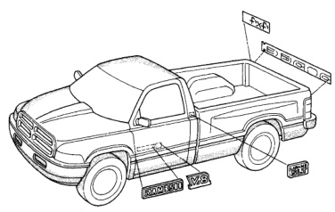

# BR BODY 23 - 27

## REMOVAL AND INSTALLATION (Continued)

*Fig. 16 Right Front Fender]*

backing from the body (Fig. 16) and (Fig. 17).

*Fig. 17 Exterior Nameplates—Club Cab]*

(2) Clean adhesive residue from body with MOPAR Super Clean solvent or equivalent.

#### INSTALLATION

(1) Remove protective cover from adhesive tape on back of emblem.

(2) Position emblem properly on body.

(3) Press emblem firmly to body with palm of hand.

(4) If temperature is below 21°C (70°F) warm emblem with a heat lamp or gun to assure adhesion. Do not exceed 52°C (120°F) when heating emblem.

*Fig. 18 Exterior Nameplates]*
