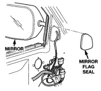

# BR BODY 23 - 28

## REMOVAL AND INSTALLATION (Continued)

### B-PILLAR APPLIQUE

#### REMOVAL

(1) Using a heat lamp, warm B-pillar to 38°C (100°F).

(2) Remove B-pillar secondary seal, BE vehicles only.

(3) Remove inner and outer belt weatherstrip.

(4) Remove glass run weatherstrip.

(5) Using an even pressure pull, peel B-pillar applique away from the B-pillar.

#### INSTALLATION

Installation equipment needed:
- Lint free applicator cloth
- Six inch applicator squeegee
- Piercing pin

(1) Clean B-pillar using Mopar Super Kleen or equivalent.

(2) Wipe surface with a lint free cloth.

(3) Using a heat gun, warm surface to 22°C (70°F).

(4) Fold down, up/down locator tab (1a or 1b) (Fig. 18) along crease.

*Fig. 18 B-Pillar Applique]*

**Legend:**
- 1A = Club Cab Up/Down
- 1B = Quad Cab Up/Down
- 2 = Adhesion Strip
- 3A = Club Cab For/Aft
- 3B = Quad Cab For/Aft
- 4 = Rear Edge Locator

(5) Remove carrier from adhesion strip (2).

(6) Using up/down locator tab (1a or 1b) and fore/aft locator tab (3a or 3b), position the applique on the upper portion of the B-pillar.

(7) Using the lower edge locator (4), position the applique on the lower portion of the B-pillar.

(8) Verify the applique is positioned correctly and press the adhesion strip (2) to the door to temporarily secure it in place.

(9) Remove the carrier for the applique.

(10) Holding the applique from the surface, apply firm downward pressure with a six inch applicator squeegee. Ensure the lower rear edge (4) is aligned correctly.

(11) Wrap edges around door to at least a 90° angle.

(12) Remove premask by pulling in a firm continuous manner from top down at 180°.

(13) Complete wrapping applique around the door edges.

(14) Inspect for air bubbles. Small bubbles can be pierced with a sharp pin and smoothed out.

(15) Install glass run weatherstrip.

(16) Install inner and outer belt weatherstrip.

(17) Install B-pillar secondary seal, BE vehicles only.

### SIDEVIEW MIRROR

#### REMOVAL

(1) Remove door trim panel.

(2) Remove mirror flag door seal (Fig. 19).

(3) Disengage power mirror wire connector from door harness, if equipped (Fig. 20).

(4) Remove nuts attaching sideview mirror to door frame (Fig. 21).

(5) Separate harness grommet from door frame, if equipped.

(6) Separate sideview mirror from vehicle.

[Figure: Fig. 19 Mirror Flag Door Seal]
