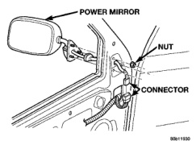
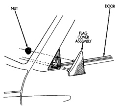
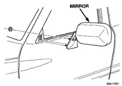

# BR BODY 23 - 29

## REMOVAL AND INSTALLATION (Continued)

*Fig. 20 Sideview Mirror—Power]*

*Fig. 21 Sideview Mirror]*

#### INSTALLATION

(1) Position sideview mirror on door.

(2) Install harness grommet in door frame, if equipped.

(3) Install nuts attaching sideview mirror to door (Fig. 21).

(4) Engage power mirror wire connector to harness, if equipped (Fig. 20).

(5) Install mirror flag door seal (Fig. 19).

(6) Install door trim panel.

### MIRROR FLAG COVER

#### REMOVAL

(1) Remove door trim panel.

(2) Remove flag door seal.

(3) Remove nuts holding door flag cover to door frame (Fig. 22).

(4) Separate flag cover from vehicle.

#### INSTALLATION

Reverse the preceding operation.

*Fig. 22 Mirror Flag Cover]*

### LOW MOUNTED SIDE VIEW MIRROR

#### REMOVAL

(1) Remove bolts holding lower support legs to outer door panel.

(2) Remove bolts holding upper support arms to outer door panel (Fig. 23).

(3) Separate mirror from vehicle.

#### INSTALLATION

Place insulation washers between support frame and painted door panel and reverse the preceding operation.

### FRONT DOOR TRIM PANEL

#### REMOVAL

(1) Release door latch and open door.

(2) Roll window down.

(3) Remove window crank (Fig. 24), if equipped.

(4) Remove screws holding door trim panel to door from inside arm rest pull cup (Fig. 25).

(5) Disengage clips holding power window/lock switch panel to door trim panel (Fig. 26). Disengage wire connectors from switch panel, if equipped.

(6) Remove screw holding door trim to outside mirror frame.

(7) Using a trim panel removal tool, disengage clips holding door trim to door around perimeter of trim panel.

(8) Disengage power mirror wire connector, if equipped.
