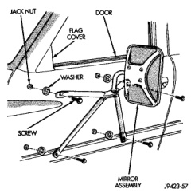
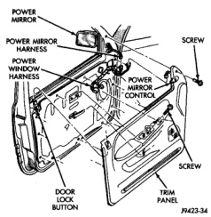
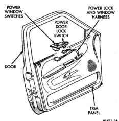
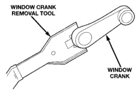

# BR BODY 23 - 30

## REMOVAL AND INSTALLATION (Continued)

*Fig. 23 Low Mounted Side View Mirror]*

(9) While holding bottom of trim panel away from door, simultaneously lift upward and forward.

(10) Separate door trim panel from inner belt weatherstrip.

(11) Disengage power outside mirror wire connector from control switch.

(12) Separate door trim panel from vehicle.

*Fig. 24 Window Crank—Typical]*

#### INSTALLATION

Reverse the preceding operation.

*Fig. 25 Door Trim Panel]*

*Fig. 26 Power Window/Lock Switch Panel]*

### FRONT DOOR WATER DAM

#### REMOVAL

(1) Remove door trim panel.

(2) Peel water dam away from adhesive around perimeter of inner door panel (Fig. 27).
