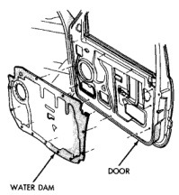
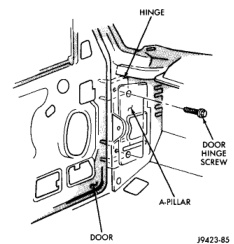
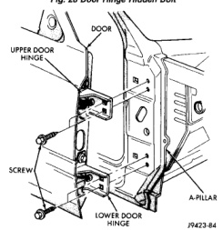

# BR BODY 23 - 31

## REMOVAL AND INSTALLATION (Continued)

*Fig. 27 Door Water Dam]*

#### INSTALLATION

Reverse the preceding operation.

### FRONT DOOR

#### REMOVAL

(1) Release door latch and open door.

(2) Remove cowl trim panel.

(3) Disengage door wire harness connector of instrument panel harness and push door harness through access hole in pillar.

(4) Remove hidden bolts attaching door hinge to hinge pillar from behind cowl panel (Fig. 28).

(5) Using a suitable marker, mark the outline of the door hinges on the hinge pillar to aid installation.

(6) Support door on a suitable lifting device.

(7) Remove bolts attaching lower door hinge to hinge pillar (Fig. 29).

(8) While holding the door steady on lift, remove bolts attaching upper door hinge to hinge pillar.

(9) Separate door from vehicle.

#### INSTALLATION

(1) While holding door steady on lift, position door at A-pillar.

(2) Align hinges using reference marks.

(3) Install bolts attaching upper door hinge to hinge pillar.

(4) Install bolts attaching lower door hinge to hinge pillar (Fig. 29).

(5) Install hidden bolts attaching door hinge to hinge pillar from behind cowl panel (Fig. 28).

*Fig. 28 Door Hinge Hidden Bolt]*

*Fig. 29 Door]*

(6) Align door to achieve equal spacing on all sides and flush across the gaps.

(7) Tighten hinge bolts to 28 N-m (21 ft. lbs.) torque.

(8) Route harness through door and engage door wire harness connector.

(9) Install cowl trim panel.
