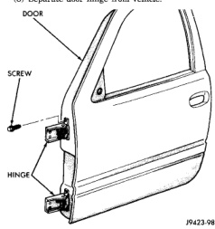
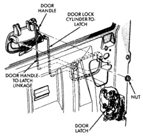

# BR BODY 23 - 32

## REMOVAL AND INSTALLATION (Continued)

### FRONT DOOR HINGE

#### REMOVAL

(1) Release door latch and open door.

(2) Remove cowl trim panel.

(3) Remove hidden bolt attaching door hinge to hinge pillar (Fig. 28).

(4) Support door on a suitable lifting device.

(5) Using a suitable marker, mark the outline of the door hinge on the hinge pillar to aid installation.

(6) Remove bolts attaching door hinge to hinge pillar (Fig. 29).

(7) Remove bolts attaching door hinge to door end frame (Fig. 30).

(8) Separate door hinge from vehicle.

*Fig. 28 Door Hinge]*

#### INSTALLATION

(1) If necessary, paint replacement door hinge before installation.

(2) Position hinge on door end frame.

(3) Align hinge using reference marks.

(4) Install bolts attaching door hinge to door end frame (Fig. 30).

(5) Install bolts attaching door hinge to hinge pillar (Fig. 29).

(6) Install hidden bolt attaching door hinge to hinge pillar (Fig. 28).

(7) Tighten hinge bolts to 28 N-m (21 ft. lbs.) torque.

(8) Remove support.

(9) Install cowl trim panel.

### FRONT DOOR OUTSIDE HANDLE

#### REMOVAL

(1) Remove door trim panel.

(2) Remove water dam as necessary to gain access to door handle.

(3) Roll glass up.

(4) Remove fastener access plug from door end panel.

(5) Disengage clips holding latch and lock rods to door latch.

(6) Separate latch and lock rods from door latch.

(7) Remove nuts holding outside door handle retaining bracket to door handle (Fig. 31).

(8) Separate retaining bracket from door.

(9) Separate outside door handle from vehicle.

*Fig. 29 Outside Door Handle]*

#### INSTALLATION

Reverse the preceding operation.

### FRONT DOOR LOCK CYLINDER

#### REMOVAL

(1) Remove outside door handle.

(2) Remove clip holding lock cylinder to outside door handle (Fig. 32).

(3) Pull door lock from door handle.

#### INSTALLATION

Reverse the preceding operation.
