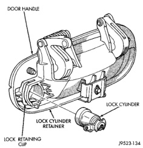
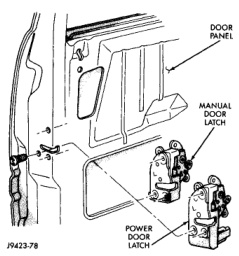
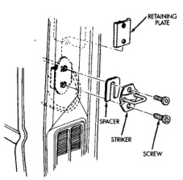

# BR BODY 23 - 33

## REMOVAL AND INSTALLATION (Continued)

*Fig. 32 Door Lock Cylinder]*

### FRONT DOOR LATCH

#### REMOVAL

(1) Remove door trim panel.

(2) Remove water dam.

(3) Disengage clips attaching lock and latch rods to door latch.

(4) Remove screws attaching door latch to door end panel (Fig. 33).

(5) Separate door latch/lock from vehicle.

#### INSTALLATION

(1) Position door latch/lock in door.

(2) Install screws attaching door latch to door end panel (Fig. 33). Tighten screws to 11 N-m (8 ft. lbs.) torque.

(3) Engage clips attaching lock and latch rods to door latch.

(4) Install water dam.

(5) Install door trim panel.

### FRONT DOOR LATCH STRIKER

#### REMOVAL

(1) Release door latch and open door.

(2) Mark outline of striker base on B-pillar to aid installation.

(3) Remove screws attaching striker to B-pillar (Fig. 34).

(4) Separate striker from vehicle.

*Fig. 33 Door Latch/Lock]*

*Fig. 34 Front Door Latch Striker]*

#### INSTALLATION

(1) Position striker on vehicle and align with reference marks.

(2) Install screws attaching striker to B-pillar. Tighten screws to 28 N-m (21 ft. lbs.) torque. (Fig. 34).
