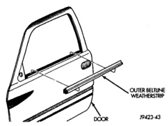
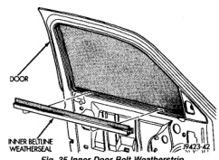
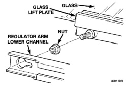

# BR BODY 23 - 34

## REMOVAL AND INSTALLATION (Continued)

### FRONT DOOR INSIDE HANDLE ACTUATOR

#### REMOVAL

(1) Raise the window to the closed position.

(2) Remove the door trim panel and water dam.

(3) Remove the screws attaching the actuator to the door.

#### INSTALLATION

(1) Install the screws attaching the actuator to the door.

(2) Test handle for proper operation.

(3) Install the door water dam and trim panel.

### FRONT DOOR INNER BELT WEATHERSTRIP

#### REMOVAL

(1) Remove door trim panel.

(2) Lift inner door belt weatherstrip upward (Fig. 35).

(3) Separate inner door belt weatherstrip from door.

*Fig. 35 Inner Door Belt Weatherstrip]*

#### INSTALLATION

Reverse the preceding operation.

### FRONT DOOR OUTER BELT WEATHERSTRIP

#### REMOVAL

(1) Roll door glass down.

(2) Remove mirror.

(3) Using a hook tool inserted into the end of the belt weatherstrip, lift upward.

(4) Separate outer door belt weatherstrip from vehicle (Fig. 36).

#### INSTALLATION

Reverse the preceding operation.

*Fig. 36 Outer Door Belt Weatherstrip]*

### FRONT DOOR GLASS

#### REMOVAL

(1) Remove door trim panel.

(2) Remove water dam as necessary to gain access to door glass lift plate.

(3) Remove inner door belt weatherstrip.

(4) Align door glass lift plate to access holes in inner door panel.

(5) Loosen bolts attaching front lower run channel to inner door panel.

(6) Remove nuts attaching door glass to lift plate (Fig. 37).

(7) Separate glass from lift plate.

(8) Lift glass upward and out of opening at top of door.

*Fig. 37 Door Glass]*

#### INSTALLATION

(1) Position glass in door.

(2) Insert glass in lift plate.
