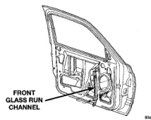
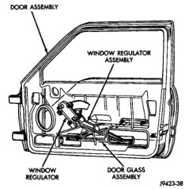
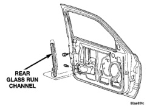

# BODY 23 - 35

## REMOVAL AND INSTALLATION (Continued)

**CAUTION: Do not exceed 11 N-m (8 ft. lbs.) torque when tightening the nuts that attach the glass to the lift plate.**

(3) Install nuts attaching glass to lift plate (Fig. 37). Tighten nuts to 9 N-m (7 ft. lbs.) torque.

(4) Tighten bolts attaching front lower run channel to inner door panel.

(5) Install inner door belt weatherstrip.

(6) Install water dam.

(7) Install door trim panel.

## FRONT DOOR WINDOW REGULATOR

### REMOVAL

(1) Remove door trim panel.

(2) Remove water dam.

(3) Remove nuts attaching door glass to window regulator.

(4) Remove glass from door or move glass to full up position and secure glass to door with tape.

(5) Disengage power window motor wire connector from door harness, if equipped.

(6) Remove bolts attaching window regulator to inner door panel.

(7) Separate window regulator from door panel (Fig. 38).

(8) Extract window regulator through access hole in inner door panel.

*Fig. 38 Door Glass Window Regulator]*

### INSTALLATION

(1) Position window regulator in door through access hole.

(2) Install bolts attaching window regulator to inner door panel.

(3) Engage power window motor wire connector to door harness, if equipped.

(4) Install glass in lift plate.

(5) Install water dam.

(6) Install door trim panel.

## FRONT DOOR GLASS RUN LOWER CHANNELS

### REMOVAL

(1) Remove door trim panel and waterdam.

(2) Roll door glass up.

(3) Remove bolts holding run channel to inner door panel (Fig. 39) and (Fig. 40).

(4) Slide channel downward to disengage it from the upper glass frame.

(5) Separate door glass run channel from door.

*Fig. 39 Front Glass Run Lower Channel]*

*Fig. 40 Rear Glass Run Lower Channel]*

### INSTALLATION

(1) Position door glass run channels on inner door panel.
