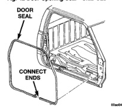
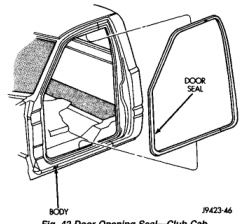
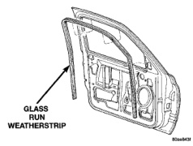

# BODY 23 - 36

## REMOVAL AND INSTALLATION (Continued)

(2) Slide channel upward to engage it in the upper glass frame.

(3) Install bolts attaching run channels to inner door panel (Fig. 39) and (Fig. 40).

(4) Install door trim panel and waterdam.

## FRONT DOOR GLASS RUN WEATHERSTRIP

### REMOVAL

(1) Remove door trim panel.

(2) Remove inner door belt weatherstrip.

(3) Pull door glass run weatherstrip from channel around window opening (Fig. 41).

*Fig. 41 Door Glass Run Weatherstrip]*

### INSTALLATION

(1) Press door glass run weatherstrip into channel around window opening (Fig. 41).

(2) Install inner door belt weatherstrip.

(3) Install door trim panel.

## DOOR OPENING SEAL

### REMOVAL

(1) Remove A-pillar molding.

(2) Remove cowl panel and sill cover.

(3) Remove quarter trim panel, if equipped.

(4) Pull seal from pinch flange around door opening (Fig. 42) and (Fig. 43).

### INSTALLATION

(1) Press seal onto pinch flange around door opening (Fig. 42).

(2) Connect the seal ends, if equipped.

(3) Install quarter trim panel, if equipped.

(4) Install cowl panel and sill cover.

(5) Install A-pillar molding.

*Fig. 39 Door Opening Seal-Club Cab]*

*Fig. 40 Door Opening Seal-Quad Cab]*

## B-PILLAR SECONDARY SEAL

### REMOVAL

(1) Warm the seal and body metal to approximately 38 degrees C (100 degrees F) using a suitable heat lamp or heat gun.

(2) Pull seal from painted surface (Fig. 44).

### INSTALLATION

(1) Remove adhesive tape residue from painted surface of vehicle.

(2) If seal is to be reused, remove tape residue from seal. Clean back of seal with MOPAR Super
