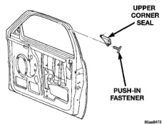
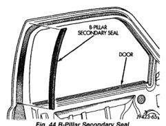
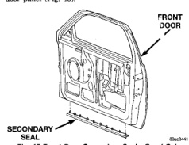

# BODY 23 - 37

## REMOVAL AND INSTALLATION (Continued)

Kleen solvent or equivalent. Wipe seal dry with lint free cloth. Apply new body side moulding (two sided adhesive) tape to back of seal.

(3) Clean body surface with MOPAR Super Kleen solvent or equivalent. Wipe surface dry with lint free cloth.

(4) Remove protective cover from tape on back of seal and apply seal to body.

(5) Heat body and seal, see step one. Firmly press seal to body surface to assure adhesion.

*Fig. 45 B-Pillar Secondary Seal]*

## FRONT DOOR SECONDARY SEAL

### REMOVAL

(1) Remove the push-in fasteners attaching the secondary seal to the inner door panel.

(2) Separate the secondary seal from the inner door panel (Fig. 45).

*Fig. 46 Front Door Secondary Seal-Quad Cab]*

### INSTALLATION

(1) Position the secondary seal on the inner door panel.

(2) Install the push-in fasteners attaching the secondary seal to the inner door panel.

## FRONT DOOR UPPER CORNER SEAL

### REMOVAL

(1) Remove the push-in fasteners attaching the upper corner seal to the front door (Fig. 46).

(2) Separate the upper corner seal from the door.

*Fig. 47 Upper Corner Seal-Quad Cab]*

### INSTALLATION

(1) Position the upper corner seal on the door.

(2) Install the push-in fasteners attaching the upper corner seal to the front door (Fig. 46).

## CARGO DOOR TRIM PANEL

### REMOVAL

(1) Remove the screws attaching the cargo door pull cup to the cargo door (Fig. 47).

(2) Remove the screw attaching the inside release handle to the cargo door.

(3) Using a trim panel removal tool, remove the push-in fasteners attaching the trim panel to the cargo door.

(4) Pull the trim panel outward to disengage the spring clips.

(5) Separate the trim panel from the cargo door.

(6) Disengage the cargo door release cable from the inside release handle (Fig. 49).

### INSTALLATION

(1) Engage the cargo door release cable to the inside release handle (Fig. 49).

(2) Position the trim panel on the cargo door.

(3) Align all fasteners and starting at the top of the panel, push into place to secure.

(4) Install the screw attaching the inside release handle to the cargo door.
