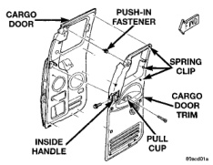
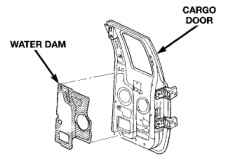
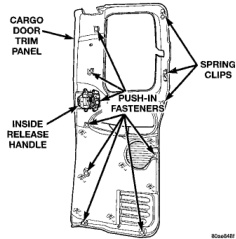
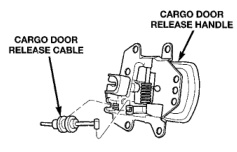
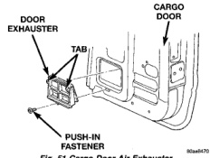

# BODY 23 - 38

## REMOVAL AND INSTALLATION (Continued)

(5) Install the screws attaching the cargo door pull cup to the cargo door (Fig. 47).

*Fig. 47 Cargo Door Trim Panel]*

*Fig. 48 Cargo Door Trim Panel Fasteners]*

*Fig. 49 Cargo Door Release Cable]*

## CARGO DOOR WATERDAM

### REMOVAL

(1) Remove cargo door trim panel.

(2) Carefully peel waterdam from door (Fig. 50).

*Fig. 50 Cargo Door Waterdam]*

### INSTALLATION

If a replacement waterdam is being applied, clean cargo door inner panel with Mopar Super Clean or equivalent.

(1) Position waterdam on cargo door and press into place.

(2) Install cargo door trim panel.

## CARGO DOOR AIR EXHAUSTER

### REMOVAL

(1) Remove cargo door trim panel.

(2) Peel back waterdam.

(3) Remove push-in fastener attaching air exhauster to cargo door inner panel (Fig. 51).

(4) Separate air exhauster from cargo door.

*Fig. 51 Cargo Door Air Exhauster]*
