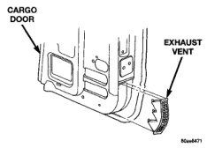
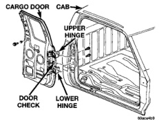
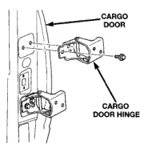

# BODY 23 - 39

## REMOVAL AND INSTALLATION (Continued)

### INSTALLATION

(1) Position air exhauster in cargo door.

(2) Engage air exhauster upper tabs with cargo door inner panel.

(3) Install push-in fastener attaching air exhauster to cargo door inner panel (Fig. 51).

(4) Install waterdam.

(5) Install cargo door trim panel.

## CARGO DOOR EXHAUST VENT

### REMOVAL

(1) Using a trim stick, carefully pry bottom of vent to disengage from door (Fig. 52).

(2) Separate vent from door.

*Fig. 52 Cargo Door Exhaust Vent]*

### INSTALLATION

(1) Position upper side of vent in door opening.

(2) Slide upward until tabs on top edge are in place.

(3) Push the lower side of the vent towards the door until the tabs snap into place.

(4) Ensure vent is fully seated.

## CARGO DOOR

### REMOVAL

(1) Using a grease pencil or equivalent, mark the position of the hinge on the door.

(2) Remove the cargo door trim panel.

(3) Remove the cargo door check strap from the cab C-pillar.

(4) Using the access hole in the cargo door inner panel, disengage the speaker wire from the speaker and route the wire through the door.

(5) Support the cargo door on a suitable device.

(6) Remove the bolts attaching the hinges to the cargo door (Fig. 53).

*Fig. 53 Cargo Door]*

### INSTALLATION

(1) Support the cargo door on a suitable device.

(2) Using the alignment marks, position the door at the hinge.

(3) Install the bolts attaching the hinges to the cargo door (Fig. 53). Tighten the bolts to 28 N-m (21 ft. lbs.) torque.

(4) Route the speaker wire through the door and using the access hole in the cargo door inner panel, engage the speaker wire at the speaker.

(5) Install the cargo door check strap at the cab C-pillar.

(6) Install the cargo door trim panel.

## CARGO DOOR HINGE

### REMOVAL

(1) Remove cargo door.

(2) Remove rear seat.

(3) Remove quarter trim panel.

(4) Remove bolts attaching hinge to C-pillar (Fig. 54).

(5) Separate hinge from vehicle.

*Fig. 51 Cargo Door Hinge]*
