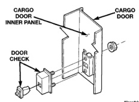
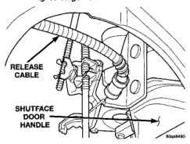
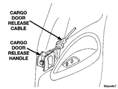

# BODY 23 - 40

## REMOVAL AND INSTALLATION (Continued)

### INSTALLATION

(1) Position hinge on vehicle.

(2) Install bolts attaching hinge to C-pillar (Fig. 54). Tighten bolts to 28 N-m (21 ft. lbs.) torque.

(3) Install quarter trim panel.

(4) Install rear seat.

(5) Install cargo door.

## CARGO DOOR DOOR CHECK

### REMOVAL

(1) Remove cargo door trim panel.

(2) Remove the bolts attaching the door check to the cab C-pillar.

(3) Remove the nuts attaching the door check to the cargo door (Fig. 55).

(4) Remove the door check through the access hole in the cargo door.

*Fig. 55 Door Check]*

### INSTALLATION

(1) Position the door check in the cargo door through the access hole.

(2) Install the nuts attaching the door check to the cargo door (Fig. 55).

(3) Install the bolts attaching the door check to the cab C-pillar.

(4) Install cargo door trim panel.

## CARGO DOOR RELEASE CABLE

### REMOVAL

(1) Remove cargo door trim panel.

(2) Disengage release cable from inside release handle (Fig. 56).

(3) Peel back waterdam.

(4) Disengage release cable from shutface door handle (Fig. 57).

(5) Separate release cable from cargo door.

*Fig. 56 Cargo Door Release Handle]*

*Fig. 54 Shutface Door Handle]*

### INSTALLATION

(1) Position release cable in cargo door.

(2) Engage release cable to shutface door handle.

(3) Install waterdam.

(4) Engage release cable to inside release handle.

(5) Install cargo door trim panel.

## CARGO DOOR SHUTFACE HANDLE

### REMOVAL

(1) Remove cargo door trim panel.

(2) Peel back waterdam.

(3) Disengage upper and lower latch release rods from shutface handle (Fig. 58).

(4) Disengage cargo door release cable.

(5) Remove screws attaching shutface handle to cargo door (Fig. 59).

(6) Separate handle from cargo door.
