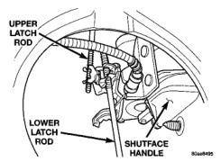
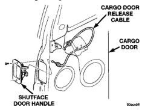
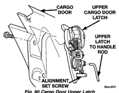

# BODY 23 - 41

## REMOVAL AND INSTALLATION (Continued)

*Fig. 58 Cargo Door Latch Rods]*

*Fig. 59 Shutface Handle]*

### INSTALLATION

(1) Position handle in cargo door.

(2) Install screws attaching shutface handle to cargo door (Fig. 59).

(3) Engage cargo door release cable.

**CAUTION: When engaging upper and lower latch release rods to shutface handle, ensure the upper latch rod is pushed all the way up and the lower latch rod is pushed all the way down before engaging into the shutface handle.**

(4) Engage upper and lower latch release rods to shutface handle.

(5) Cycle the shutface handle and verify operation.

(6) Install waterdam.

(7) Install cargo door trim panel.

## CARGO DOOR UPPER LATCH

### REMOVAL

(1) Remove cargo door trim panel.

(2) Using a grease pencil or equivalent, mark the position of the bolts.

(3) Disengage upper latch release rod from shutface handle.

(4) Remove the bolts attaching upper latch to cargo door (Fig. 60).

(5) Separate upper latch and latch rod from cargo door.

*Fig. 60 Cargo Door Upper Latch]*

### INSTALLATION

(1) The new replacement latch is supplied with an alignment set screw located in the lower mounting hole of the upper cargo door latch. If a new latch is being installed, use the following procedure:

(a) Verify alignment set screw is fully seated in latch.

(b) Engage latch rod to latch.

(c) Position latch in cargo door with alignment set screw located in the lower hole.

(d) Align bolt with reference mark.

(e) Install upper bolt. Tighten bolt to 23 N-m (17 ft. lbs.) torque.

(f) Engage latch rod to shutface handle.

(g) Remove alignment set screw from lower hole.

(h) Align lower bolt with reference mark.

(i) Install bolt in lower hole. Tighten bolt to 23 N-m (17 ft. lbs.) torque.

**CAUTION: When engaging upper latch release rod to shutface handle, ensure the latch rod is pushed all the way up before engaging into the shutface handle.**
