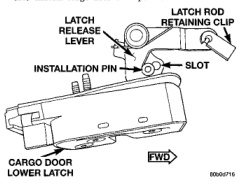
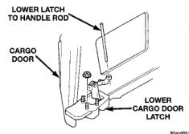

# BODY 23 - 42

## REMOVAL AND INSTALLATION (Continued)

(2) If the latch was not replaced and the existing latch is to be installed:

(a) Engage latch rod to latch.

(b) Position upper latch and latch rod in cargo door.

(c) Align bolts with reference marks.

(d) Install the bolts attaching upper latch to cargo door (Fig. 60). Tighten the bolts to 23 N-m (17 ft. lbs.) torque.

(e) Engage upper latch release rod to shutface handle.

(3) Cycle the shutface handle and verify latch operation.

(4) Install cargo door trim panel.

## CARGO DOOR LOWER LATCH

### REMOVAL

(1) Remove cargo door trim panel.

(2) Peel back waterdam to access air exhauster.

(3) Remove cargo door air exhauster.

(4) Disengage lower latch to shutface handle rod at shutface handle (Fig. 61).

(5) Remove nuts attaching lower latch to cargo door.

(6) Separate lower latch and latch rod from cargo door.

*Fig. 61 Cargo Door Lower Latch]*

### INSTALLATION

(1) If installing a new replacement latch:

(a) Engage latch rod to latch rod retaining clip in lower latch. Ensure "white" latch installation pin is in the position closest to the latch release lever (Fig. 62).

(2) If the latch was not replaced and the existing latch is to be installed:

(a) Slide "white" latch installation pin to the position closest to the latch release lever.

(3) Position lower latch and latch rod in cargo door.

(4) Install nuts attaching lower latch to cargo door. Tighten nuts to 12 N-m (9 ft. lbs.) torque (Fig. 61).

(5) Engage latch rod to latch rod retaining clip in lower latch.

**CAUTION: When engaging lower latch release rod to shutface handle, ensure lower latch rod is pushed all the way down before engaging to the handle.**

(6) Engage lower latch rod to shutface handle.

(7) Cycle the shutface handle and verify latch operation.

(8) Install cargo door air exhauster.

(9) Install waterdam.

(10) Install cargo door trim panel.

*Fig. 60 Cargo Door Lower Latch Installation Pin]*

## CARGO DOOR UPPER STRIKER

### REMOVAL

(1) Remove screws attaching striker trim cover to roof.

(2) Remove bolts attaching striker to roof (Fig. 63).

(3) Separate upper striker from roof.

### INSTALLATION

(1) Position upper striker on roof.

(2) Install bolts attaching striker to roof (Fig. 63). Tighten bolts to 23 N-m (17 ft. lbs.) torque.

(3) Install the screws attaching striker trim cover to roof.

## CARGO DOOR LOWER STRIKER

### REMOVAL

(1) Using a grease pencil or equivalent, mark the position of the lower striker on the sill.

(2) Remove the torx screws attaching the striker to the sill (Fig. 63).

(3) Separate striker from sill.
