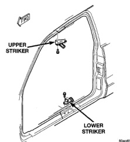
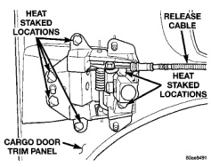
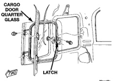

# BODY 23 - 43

## REMOVAL AND INSTALLATION (Continued)

*Fig. 63 Cargo Door Strikers]*

### INSTALLATION

(1) Using the alignment marks, position striker on sill.

(2) Install the torx screws attaching the striker to the sill (Fig. 63). Tighten screws to 28 N-m (21 ft. lbs.) torque.

## CARGO DOOR INSIDE HANDLE ACTUATOR

**NOTE: The cargo door inside handle actuator is heat staked to the trim panel (Fig. 64).**

### REMOVAL

(1) Remove trim panel from cargo door.

(2) Disengage release cable from inside handle.

(3) Using a small file, Dremel tool or die grinder, remove the melted material securing the handle to the trim panel.

(4) Separate the handle from the trim panel.

### INSTALLATION

(1) Position the handle in the trim panel.

(2) Using a soldering gun, and using the additional studs, heat stake the handle to the trim panel.

(3) Engage release cable to inside handle.

(4) Install cargo door trim panel.

## CARGO DOOR VENT WINDOW

### REMOVAL

(1) Remove cargo door trim panel.

(2) Remove the screws attaching the latch to the cargo door (Fig. 65).

*Fig. 64 Heat Staked Locations]*

(3) Remove the bolts attaching the vent glass to the cargo door (Fig. 66).

(4) Remove the glass from the door.

(5) If necessary, remove the latch from the glass.

*Fig. 65 Cargo Door Quarter Glass Vent Window Latch]*

### INSTALLATION

(1) If removed, install the latch to the glass. Tighten the screw with 5 N-m (45 in. lbs.) torque.

(2) Center the glass in the cargo door opening.

(3) Install the bolts attaching the vent glass to the cargo door.

(4) Install the screws attaching the latch to the cargo door.

(5) Install cargo door trim panel.

## CARGO DOOR VENT WINDOW WEATHERSTRIP

### REMOVAL

(1) Remove the vent window.

(2) Peel the weatherstrip from the glass.

(3) Separate the weatherstrip from the cargo door.
