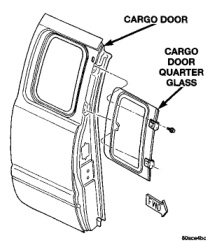
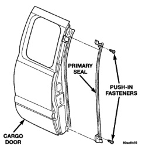
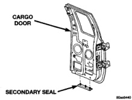

# BODY 23 - 44

## REMOVAL AND INSTALLATION (Continued)

*Fig. 66 Cargo Door Quarter Glass Vent Window]*

### INSTALLATION

(1) Position the weatherstrip on the glass.

(2) Press the weatherstrip to seat.

(3) Install the vent window.

## CARGO DOOR PRIMARY SEAL

### REMOVAL

(1) Remove the push-in fasteners attaching the primary seal to the cargo door (Fig. 67).

(2) Separate the seal from the door.

### INSTALLATION

(1) Position the seal on the door.

(2) Install the push-in fasteners attaching the primary seal to the cargo door (Fig. 67).

## CARGO DOOR SECONDARY SEAL

### REMOVAL

(1) Remove the push-in fasteners attaching the secondary seal to the inner cargo door panel.

(2) Separate the secondary seal from the inner cargo door panel (Fig. 68).

*Fig. 67 Cargo Door Primary Seal]*

*Fig. 68 Cargo Door Secondary Seal]*

### INSTALLATION

(1) Position the secondary seal on the inner cargo door panel.

(2) Install the push-in fasteners attaching the secondary seal to the inner cargo door panel.
