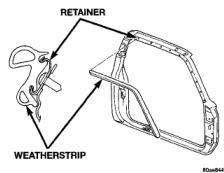
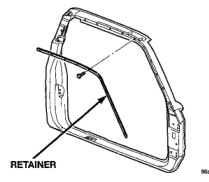
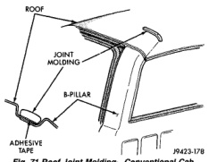
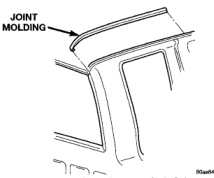

# BODY 23 - 45

## REMOVAL AND INSTALLATION (Continued)

## ROOF RAIL WEATHERSTRIP AND RETAINER

### REMOVAL

(1) Release door latch and open door(s).

(2) Starting from rearward end of weatherstrip, slide weatherstrip out of retainer (Fig. 69).

(3) Remove screws attaching retainer to roof rail (Fig. 70).

(4) Separate retainer from vehicle.

*Fig. 69 Roof Rail Weatherstrip-Quad Cab]*

*Fig. 70 Roof Rail Weatherstrip Retainer-Quad Cab]*

### INSTALLATION

(1) If removed, install screws attaching retainer to roof rail (Fig. 70).

(2) Starting at the forward end of retainer and working rearward, slide weatherstrip into the retainer (Fig. 69).

(3) Peel the carrier from forward end of the weatherstrip and press to secure.

## ROOF JOINT MOLDING

### REMOVAL

(1) Warm the roof joint molding and roof panel to approximately 38 degrees C (100 degrees F) using a suitable heat lamp or heat gun.

(2) Pull molding from roof joint (Fig. 71), (Fig. 72) and (Fig. 73).

### INSTALLATION

(1) Remove adhesive tape residue from roof joint.

(2) If molding is to be reused, remove tape residue from back of molding. Clean molding with MOPAR Super Kleen solvent or equivalent. Wipe molding dry with lint free cloth. Apply new body side molding (two sided adhesive) tape to back of molding.

(3) Clean roof joint with MOPAR Super Kleen solvent or equivalent. Wipe dry with lint free cloth.

(4) Remove protective cover from tape on back of molding and apply molding to roof joint.

(5) Heat roof and molding, see step one. Firmly press molding into roof joint to assure adhesion.

*Fig. 71 Roof Joint Molding-Conventional Cab]*

*Fig. 72 Roof Joint Molding-Club Cab]*
