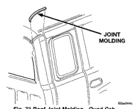
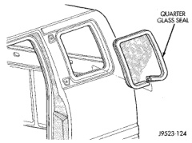
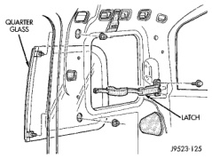

# BODY 23 - 46

## REMOVAL AND INSTALLATION (Continued)

*Fig. 73 Roof Joint Molding-Quad Cab]*

## QUARTER VENT WINDOW-CLUB CAB

### REMOVAL

(1) Remove quarter trim panel.

(2) Remove the latch retaining screws from the cab rear side panel (Fig. 74).

(3) Remove the frame/hinge retaining nuts from the B-pillar.

(4) Remove the window glass from the cab.

(5) If necessary, remove the latch from the glass.

*Fig. 74 Vent Window-Club Cab]*

### INSTALLATION

(1) If removed, install the latch to the glass. Tighten the screw with 6 N-m (60 in. lbs.) torque.

(2) Center the window glass at the opening, insert the hinge studs in the B-pillar holes, and install the retaining nuts. Tighten the nuts with 11 N-m (95 in. lbs.) torque.

(3) Attach the latch to the rear side panel with the screws. Tighten the screws with the latch in the lock position and pushing rearward on the latch. Tighten the screws with 11 N-m (95 in. lbs.) torque.

(4) Test the vent window for water leaks.

(5) Install quarter trim panel.

## QUARTER VENT WINDOW WEATHERSTRIP

### REMOVAL

(1) Remove the window. If necessary, refer to the removal procedure.

(2) Pull the seal away from the flange around the perimeter of the window opening (Fig. 75).

(3) Clean the flange as necessary.

*Fig. 75 Weatherstrip Seal Removal/Installation]*

### INSTALLATION

(1) Center and butt the seal ends together at the bottom, centerline of the opening.

(2) Mate the seal with the bottom flange.

(3) Mate the seal with the front, vertical flange.

(4) Move upward and mate the seal with the top flange.

(5) Mate the seal with the rear, vertical flange.

## BODY VENT

### REMOVAL

(1) Release door latch and open door.

(2) Pull outward at top of vent to disengage clips holding vent to door jamb (Fig. 76).

(3) Separate vent from vehicle.

### INSTALLATION

Reverse the preceding operation.

## TAPE STRIPE

### REMOVAL

(1) If the panel that is being serviced is not going to be refinished, apply a length of masking tape parallel to the edge of the original tape stripe to aid installation.

(2) Warm the panel to approximately 38 degrees C (100 degrees F) using a suitable heat lamp or heat gun.

(3) Peel tape stripe (Fig. 77) from body panel using an even pressure pull.
