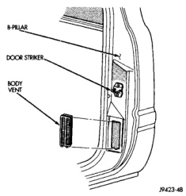
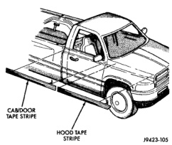

# BODY 23 - 47

## REMOVAL AND INSTALLATION (Continued)

*Fig. 76 Body Vent]*

(4) Remove adhesive residue from body panel using a suitable adhesive removing solvent.

*Fig. 77 Tape Stripe Overlay]*

### INSTALLATION

The painted surface of the body panel to be covered by a tape stripe overlay must be smooth and completely cured before overlay can be applied. If painted surface is not smooth, wet sand with 600 grit wet/dry sand paper until surface is smooth. Ripples and feather edging will read through overlay if surface is not properly prepared. Clean all residue from surface.

**Installation equipment:**

- Pail filled with mild dish soap solution.
- Lint free applicator cloth or sponge.
- Body putty applicator squeegee.
- Heat gun or sun lamp.
- Razor knife.

(1) Spread replacement tape stripe overlay across a smooth flat work surface, finish side down.

(2) Peel paper backing away from overlay exposing adhesive back of overlay.

(3) Apply soap solution liberally to adhesive back of overlay.

(4) Apply soap solution liberally to body panel surface.

(5) Place overlay into position on body panel. Smooth out wrinkles by pulling lightly on edges of overlay until it lays flat on painted surface.

(6) Push air pockets from under overlay to the perimeter of the panel from the center of the overlay out.

(7) Squeegee soap solution and air bubbles from behind overlay from the center of the panel out using a body putty applicator squeegee (Fig. 78).

(8) Trim overlay to size using a razor knife. Leave at least 13 mm (0.5 in.) for edges of doors and openings.

(9) Apply heat to overlay to evaporate residual moisture from edges of overlay and to allow overlay to be stretched into concave surfaces.

(10) Edge turn overlay around doors or fenders.

(11) Install exterior trim if necessary.

(12) Small air or water bubbles under overlay can be pierced with a pin and smoothed out.

## BODY SIDE MOLDINGS

### REMOVAL

(1) Warm the affected stick-on molding and body metal to approximately 38 degrees C (100 degrees F) using a suitable heat lamp or heat gun.

(2) Pull stick-on molding from painted surface (Fig. 79), (Fig. 80) and (Fig. 81).

### INSTALLATION

(1) Clean body surface with MOPAR Super Kleen solvent or equivalent. Wipe surface dry with lint free cloth.
