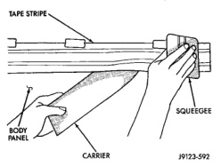
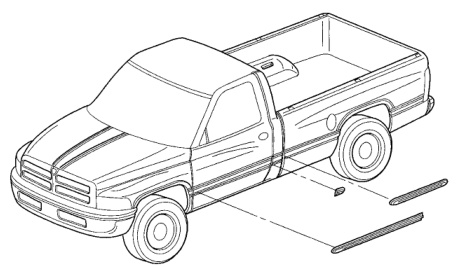

# BODY 23 - 48

## REMOVAL AND INSTALLATION (Continued)

*Fig. 78 Tape Stripe Application]*

(2) Apply a length of masking tape on the body, parallel to the top edge of the molding to use as a guide, if necessary.

(3) Remove protective cover from tape on back of molding. Apply molding to body below the masking tape guide.

(4) Remove masking tape guide and heat body and molding, see step one. Firmly press molding to body surface to assure adhesion.

## FUEL FILL DOOR

### REMOVAL

(1) Open fuel fill door.

(2) Remove bolts holding fuel fill door to cargo box quarter panel (Fig. 82).

(3) Separate fuel fill door from vehicle.

### INSTALLATION

Reverse the preceding operation.

## REAR SPLASH SHIELDS

### REMOVAL

(1) Remove plastic rivets holding rear splash shield to rear wheel opening lip (Fig. 83).

(2) Remove plastic rivets holding rear splash shield to rear wheelhouse.

(3) Separate splash shield from vehicle.

### INSTALLATION

(1) Position splash shield in wheelhouse opening.

(2) Install plastic rivets holding rear splash shield to rear wheelhouse.

(3) Install plastic rivets holding rear splash shield to rear wheel opening lip.

*Fig. 82 Body Side Moldings-Conventional Cab]*
