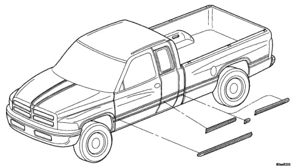
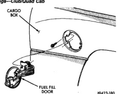
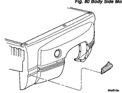

# BODY 23 - 49

## REMOVAL AND INSTALLATION (Continued)

*Fig. 81 Body Side Moldings-Club/Quad Cab]*

*Fig. 82 Body Side Moldings-Dual Wheel]*

## REAR WHEELHOUSE LINER

### REMOVAL

(1) Remove plastic rivets holding rear wheelhouse liner to rear wheel opening lip (Fig. 84).

(2) Remove plastic rivets holding rear wheelhouse liner to rear wheelhouse.

(3) Separate rear wheelhouse liner from vehicle.

*Fig. 84 Fuel Fill Door]*

### INSTALLATION

(1) Position rear wheelhouse liner in wheelhouse opening.

(2) Install plastic rivets holding rear wheelhouse liner to rear wheelhouse.

(3) Install plastic rivets holding rear wheelhouse liner to rear wheel opening lip.
