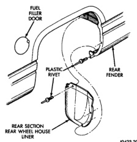
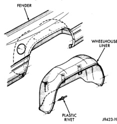
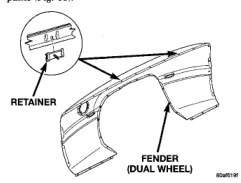

# BODY 23 - 50

## REMOVAL AND INSTALLATION (Continued)

*Fig. 83 Rear Splash Shields]*

*Fig. 84 Rear Wheelhouse Liner]*

## REAR FENDER (DUAL REAR WHEELS)

### REMOVAL

(1) Open fuel fill door, left side only.

(2) Remove screws holding fuel fill neck to rear fender opening.

(3) Remove tail lamp, refer to Group 8L, Lamps for proper procedures.

(4) Remove nuts holding rear fender to cargo box side panel through tail lamp opening.

(5) Remove clearance lamps, refer to Group 8L, Lamps for proper procedures.

(6) Remove sockets from clearance lamps.

(7) Remove bolts holding bottom of fender to cargo box forward of rear wheel.

(8) Remove bolts holding bottom of fender to cargo box rearward of rear wheel.

(9) Remove rear wheelhouse splash shields and liner.

(10) Remove nuts holding front of rear fender to cargo box from behind side panel forward of wheelhouse.

(11) Remove screws holding access panel to top of wheelhouse.

(12) Remove nuts holding rear fender to cargo box through access hole in top of wheelhouse.

(13) Separate rear fender from cargo box side panel (Fig. 85).

*Fig. 85 Rear Fender-Dual Wheels]*

### INSTALLATION

Ensure the retainers are in good condition. Reverse the preceding operation.

## TAILGATE CHECK CABLE

### REMOVAL

(1) Release tailgate latch and open tailgate.

(2) Pry lock tab outward to clear stud head on cargo box (Fig. 86).

(3) Push cable end forward until stud head is in clearance hole portion of cable end.

(4) Separate cable end from stud.

(5) Remove screw holding cable to tailgate.

(6) Separate check cable from tailgate.

### INSTALLATION

Reverse the preceding operation.
