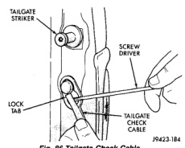
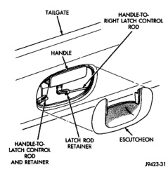
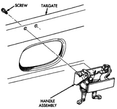

# BODY 23 - 51

## REMOVAL AND INSTALLATION (Continued)

*Fig. 86 Tailgate Check Cable]*

## TAILGATE

### REMOVAL

(1) Release tailgate latch and open tailgate.

(2) Disconnect tailgate marker light harness, if equipped.

(3) Disconnect tailgate check cable.

(4) Close tailgate until the notch in the right hand collar aligns with the pivot pin.

(5) Slip tailgate hinge collar from hinge pins.

(6) Slide tailgate to the right and separate left hand collar from the pivot pin.

(7) Separate tailgate from vehicle.

### INSTALLATION

Reverse the preceding operation.

## TAILGATE HANDLE ESCUTCHEON

### REMOVAL

(1) Lift and hold tailgate latch release handle.

(2) Using a trim stick (C-4755), pry bottom of escutcheon outward to disengage clips.

(3) Rotate escutcheon upward to disengage clip above release handle.

(4) Lift escutcheon upward from behind release handle.

(5) Separate escutcheon from vehicle (Fig. 87).

### INSTALLATION

Reverse the preceding operation.

## TAILGATE LATCH HANDLE

### REMOVAL

(1) Remove tailgate latch handle escutcheon.

(2) Disengage clips holding linkage rods to latch handle.

*Fig. 87 Tailgate Handle Escutcheon]*

(3) Separate linkage rods from handle.

(4) Remove screws holding latch handle to tailgate (Fig. 88).

(5) Separate latch handle from vehicle.

*Fig. 88 Tailgate Latch Handle]*

### INSTALLATION

Reverse the preceding operation.
