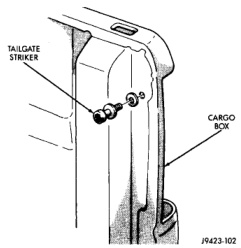
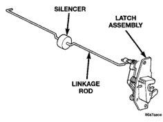
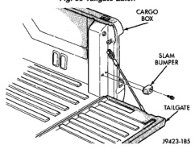

# REMOVAL AND INSTALLATION (Continued)

## TAILGATE LATCH

### REMOVAL

(1) Remove tailgate latch handle escutcheon.

(2) Release tailgate latch and open tailgate.

(3) Disengage linkage rod from latch handle (Fig. 89).

(4) Remove screws holding latch to tailgate.

(5) Separate latch from tailgate.

(6) Pull latch and linkage rod from tailgate.

*Fig. 89 Tailgate Latch]*

### INSTALLATION

Reverse the preceding operation.

## TAILGATE LATCH STRIKER

### REMOVAL

(1) Open tailgate.

(2) Mark outline of striker on cargo box jamb to aid installation.

(3) Using a Torx drive wrench, remove striker from cargo box (Fig. 90).

*Fig. 90 Tailgate Latch Striker]*

### INSTALLATION

Reverse the preceding operation.

## TAILGATE SLAM BUMPER

### REMOVAL

(1) Release tailgate latch and open tailgate.

(2) Remove screw holding slam bumper to cargo box (Fig. 91).

(3) Separate slam bumper from vehicle.

*Fig. 91 Tailgate Slam Bumper]*

### INSTALLATION

(1) Position slam bumper on vehicle.

(2) Install screw holding slam bumper to cargo box.

(3) Close tailgate and verify operation.

## TAPE STRIPE DECALS

### REMOVAL

(1) Warm the panel to approximately 38°C (100°F) using a suitable heat lamp or heat gun.

(2) Peel tape stripe from body panel using an even pressure pull.

(3) Remove adhesive residue from body panel using a suitable adhesive removing solvent.

### INSTALLATION

(1) Clean painted body surface with Mopar Super Clean solvent or equivalent and a lint free cloth.

(2) Remove protective cover from back side of decal.

---
*Source: Chapter 23 Body, Page 52*
