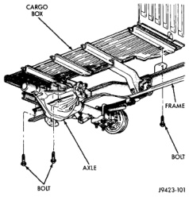
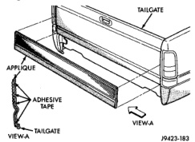

# REMOVAL AND INSTALLATION (Continued)

## TAPE STRIPE DECALS (Continued)

### INSTALLATION (Continued)

(3) Position decal properly on body.

(4) Press decal firmly to body with palm of hand.

(5) If temperature is below 21°C (70°F) warm decal with a heat lamp or gun to assure adhesion. Do not exceed 65°C (150°F) when heating emblem.

## TAILGATE APPLIQUE

### REMOVAL

(1) Apply a length of masking tape on the body, parallel to the top edge of the applique to use as a guide, if necessary.

(2) Warm the tailgate applique and tailgate metal to approximately 38°C (100°F) using a suitable heat lamp or heat gun.

(3) Pull applique from tailgate (Fig. 92).

### INSTALLATION

(1) Remove adhesive tape residue from painted surface of tailgate.

(2) If applique is to be reused, remove tape residue from applique. Clean back of applique with MOPAR Super Kleen solvent or equivalent. Wipe molding dry with lint free cloth. Apply new body side molding (two sided adhesive) tape to back of applique.

(3) Clean tailgate surface with MOPAR Super Kleen solvent or equivalent. Wipe surface dry with lint free cloth. An adhesion promoter must be applied to ensure proper applique adhesion.

(4) Remove protective cover from tape on back of applique. Apply applique to body below the masking tape guide.

(5) Remove masking tape guide and heat tailgate and applique, see step one. Firmly press applique to tailgate to assure adhesion.

*Fig. 92 Tailgate Applique]*

## CARGO BOX

### REMOVAL

(1) Open fuel fill door.

(2) Remove screws holding fuel fill neck adaptor to cargo box side wall.

(3) Separate fuel fill neck from cargo box.

(4) Disengage tail lamp wire connector from main body harness at left rear frame rail.

(5) Remove bolts holding cargo box to frame rails (Fig. 93).

(6) Using a suitable lifting device, separate cargo box from vehicle.

*Fig. 93 Cargo Box]*

### INSTALLATION

Reverse the preceding operation.

## DOOR SILL TRIM COVER

### REMOVAL

(1) Remove screws attaching door sill trim cover to door sill (Fig. 94) and (Fig. 95).

(2) Separate door sill trim cover from door sill.

### INSTALLATION

(1) Position door sill trim cover on door sill.

(2) Install screws attaching door sill trim cover to door sill.

---
*Source: Chapter 23 Body, Page 53*
