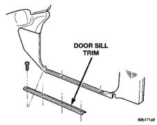
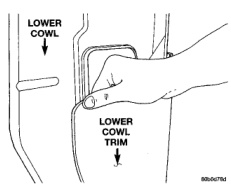
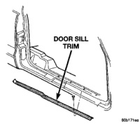
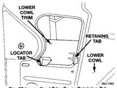
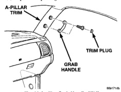

# REMOVAL AND INSTALLATION (Continued)

## DOOR SILL TRIM COVER (Continued)

*Fig. 94 Door Sill Trim Cover]*

*Fig. 95 Door Sill Trim Cover-Quad Cab]*

## COWL TRIM COVER

### REMOVAL

(1) Remove front door sill trim cover.

(2) Grasp center upper edge of cowl trim cover (Fig. 96) and pull outward allowing cowl trim cover to bow in the center releasing trim cover retaining tab (Fig. 97).

(3) Separate cowl trim cover from lower cowl.

*Fig. 96 Lower Cowl Trim Cover]*

*Fig. 97 Lower Cowl Trim Cover Retaining Tab]*

### INSTALLATION

(1) Position cowl trim cover on lower cowl.

(2) Press into place.

(3) Install front door sill trim cover.

## A-PILLAR GRAB HANDLE

### REMOVAL

(1) Using a small flat blade screw driver, pry trim plugs from A-pillar grab handle.

(2) Remove screws attaching grab handle to A-pillar (Fig. 98).

(3) Separate A-pillar grab handle from vehicle.

*Fig. 98 A-pillar Grab Handle (4X4)]*

### INSTALLATION

(1) Position grab handle on A-pillar.

(2) Install screws attaching grab handle to A-pillar (Fig. 98).

(3) Install trim plugs in A-pillar grab handle.

---
*Source: Chapter 23 Body, Page 54*
