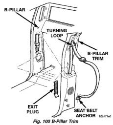

# REMOVAL AND INSTALLATION (Continued)

## A-PILLAR TRIM

### REMOVAL

(1) Remove A-pillar grab handle, if equipped.

(2) Grasp A-pillar trim at top and pull outward/downward to disengage upper spring clip (Fig. 99).

(3) Carefully pull bottom of A-pillar trim outward to disengage lower spring clip.

(4) Disengage speaker harness connector, if equipped.

(5) Separate A-pillar trim from vehicle.

*Fig. 99 A-pillar Trim]*

### INSTALLATION

(1) Position A-pillar trim in vehicle.

(2) Engage speaker harness connector, if equipped.

(3) Align spring clips and press into place.

(4) Install A-pillar grab handle, if equipped.

## B-PILLAR TRIM

### REMOVAL

(1) Remove rear floor stowage tray.

(2) Remove door sill cover as necessary to clear B-pillar trim.

(3) Remove bolt attaching seat belt anchor to floor.

(4) Pull turning loop cover up and remove bolt attaching turning loop to B-pillar.

(5) Remove seat belt exit plug (Fig. 100).

(6) Disengage clips attaching B-pillar trim to upper B-pillar.

(7) Separate B-pillar trim from B-pillar.

(8) Route seat belt webbing through opening in B-pillar trim.

*Fig. 100 B-Pillar Trim]*

### INSTALLATION

(1) Route seat belt webbing through opening in B-pillar trim.

(2) Position B-pillar trim at B-pillar.

(3) Starting at the top, engage clips attaching B-pillar trim to upper B-pillar.

(4) Install seat belt exit plug.

(5) Install bolt attaching turning loop to B-pillar and install turning loop cover.

(6) Install bolt attaching seat belt anchor to floor.

(7) Install door sill cover.

(8) Install rear floor stowage tray.

## C-PILLAR TRIM

### REMOVAL

(1) Remove rear floor stowage tray.

(2) Remove door sill cover as necessary to clear C-pillar trim.

(3) Remove bolt attaching seat belt anchor to floor.

(4) Pull turning loop cover up and remove bolt attaching turning loop to C-pillar.

(5) Remove seat belt exit plug (Fig. 101).

(6) Disengage clips attaching C-pillar trim to upper C-pillar.

(7) Separate C-pillar trim from C-pillar.

(8) Route seat belt webbing through opening in C-pillar trim.

### INSTALLATION

(1) Route seat belt webbing through opening in C-pillar trim.

(2) Position C-pillar trim at C-pillar.

(3) Starting at the top, engage clips attaching C-pillar trim to upper C-pillar.

(4) Install seat belt exit plug.

(5) Install bolt attaching turning loop to C-pillar and install turning loop cover.

(6) Install bolt attaching seat belt anchor to floor.

(7) Install door sill cover.

(8) Install rear floor stowage tray.

---
*Source: Chapter 23 Body, Page 55*
