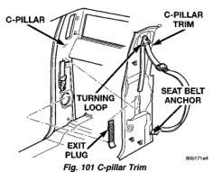
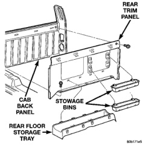
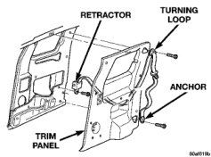

# REMOVAL AND INSTALLATION (Continued)

## C-PILLAR TRIM (Continued)

*Fig. 102 C-pillar Trim]*

## QUARTER TRIM PANEL-CLUB CAB

### REMOVAL

(1) Remove rear seat. Refer to the removal procedure in this section, if necessary.

(2) Remove door sill cover as necessary to clear quarter trim.

(3) Remove lower seat belt anchor bolt (Fig. 102).

(4) Remove seat belt turning loop anchor bolt.

(5) Disengage clips attaching quarter trim panel from quarter panel.

(6) Route seat belt webbing through opening in quarter trim panel and remove panel from vehicle.

*Fig. 103 Quarter Trim Panel-Club Cab]*

### INSTALLATION

(1) Position trim panel in vehicle and route seat belt webbing through opening in quarter trim panel.

(2) Open quarter vent window.

(3) Position trim panel on quarter panel and engage clips on upper portion of panel.

(4) Engage clips attaching lower portion of quarter trim panel to quarter panel.

(5) Install lower seat belt anchor bolt.

(6) Install door sill cover as necessary.

(7) Install rear seat. Refer to the installation procedure in this section, if necessary.

## REAR CLOSURE PANEL TRIM

### REMOVAL

(1) Remove quarter trim panels.

(2) Remove rear floor stowage tray.

(3) Remove screws attaching bottom of rear closure panel trim to floor pan (Fig. 103).

(4) Remove screws attaching rear closure panel trim to cab back panel.

(5) Disengage clips attaching top of rear closure panel trim to cab back panel.

(6) Separate rear closure panel trim from vehicle.

*Fig. 104 Rear Closure Panel Trim]*

### INSTALLATION

(1) Position rear closure panel trim in vehicle.

(2) Align and engage clips attaching top of rear closure panel trim to cab back panel.

(3) Install screws attaching rear closure panel trim to cab back panel.

(4) Install screws attaching bottom of rear closure panel trim to floor pan (Fig. 103).

(5) Install rear floor stowage tray.

(6) Install quarter trim panels.

---
*Source: Chapter 23 Body, Page 56*
