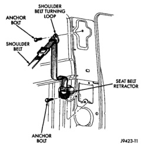
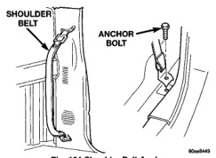
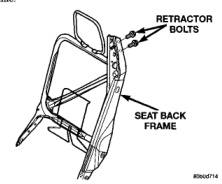

# REMOVAL AND INSTALLATION (Continued)

## SEAT BELT RETRACTOR-CONVENTIONAL CAB

**WARNING:** Inspect the shoulder belt, retractor and buckle. Replace the belt or buckle that is either cut, frayed, torn or damaged. Replace the belt if the retractor is inoperative.

### REMOVAL

(1) Remove bolt attaching shoulder belt lower anchor to floor at base of quarter trim panel (Fig. 104).

(2) Remove quarter trim panel.

(3) Remove bolt attaching seat belt turning loop to B-pillar (Fig. 105).

(4) Separate turning loop from B-pillar.

(5) Disengage body harness wire connector from seat belt retractor (driver's side only).

(6) Remove bolt attaching seat belt retractor to quarter panel.

(7) Separate seat belt retractor from vehicle.

*Fig. 104 Shoulder Belt Anchor]*

### INSTALLATION

(1) Position seat belt retractor in vehicle.

(2) Install bolt attaching seat belt retractor to quarter panel. Tighten bolt to 39 N·m (28 ft. lbs.) torque.

(3) Engage body harness wire connector from seat belt retractor (driver's side only).

(4) Position turning loop on B-pillar.

(5) Install bolt attaching seat belt turning loop to B-pillar (Fig. 105). Tighten bolt to 39 N·m (28 ft. lbs.) torque.

(6) Install quarter trim panel.

(7) Install bolt attaching shoulder belt lower anchor to floor at base of quarter trim panel (Fig. 105). Tighten bolt to 39 N·m (28 ft. lbs.) torque.

*Fig. 105 Seat Belt Retractor]*

## FRONT SEAT BELT RETRACTOR-CLUB/QUAD CAB

The seat/shoulder belt and retractor is incorporated in each driver and passenger seat.

**WARNING:** Inspect the shoulder belt, retractor and buckle. Replace the belt or buckle that is either cut, frayed, torn or damaged. Replace the belt if the retractor is inoperative.

### REMOVAL

(1) Remove the seat back cover.

(2) Remove the screws attaching the retractor cover to the seat back frame.

(3) Disengage the wire connectors from the retractor.

(4) Remove the bolts attaching the retractor to the seat back frame (Fig. 106).

(5) Separate the retractor from the seat back frame.

*Fig. 106 Seat Belt Retractor]*

---
*Source: Chapter 23 Body, Page 57*
