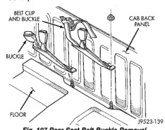
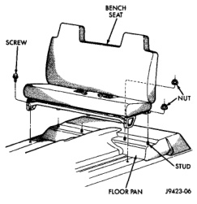

# REMOVAL AND INSTALLATION (Continued)

## FRONT SEAT BELT RETRACTOR-CLUB/QUAD CAB (Continued)

### INSTALLATION

(1) Position the retractor in the seat back frame.

(2) Install the bolts attaching the retractor to the seat back frame. Tighten the bolts to 16 N·m (11 ft. lbs.) torque.

(3) Engage the wire connectors to the retractor.

(4) Install screws attaching retractor cover to seat back frame.

(5) Install seat back cover.

## SEAT BELT BUCKLE

### REMOVAL

(1) Move seat to the forward position.

(2) Hinge seat backs forward.

(3) Remove bolt holding seat belt buckle to seat frame.

(4) Separate seat belt buckle from vehicle.

### INSTALLATION

Reverse the preceding operation. Install the seat belt buckle anchor nuts. Tighten to 40 N·m (30 ft. lbs.) torque.

## REAR SEAT BELT BUCKLE

### REMOVAL

(1) Turn release handle on underside of rear seat to disengage seat cushion and move seat to the stowed position.

Access to rear seat belt buckle nuts can be obtained through an opening between the rear seat back and the floor.

(2) Remove seat belt buckle anchor nuts (Fig. 107).

(3) Separate seat belt buckle from vehicle.

*Fig. 107 Rear Seat Belt Buckle Removal]*

### INSTALLATION

(1) Position the seat belt buckle on the anchoring studs.

(2) Install the seat belt buckle anchor nuts. Tighten to 40 N·m (30 ft. lbs.) torque.

(3) Route the belts and buckles between the seat back and seat cushion.

(4) Turn release handle to disengage seat from stowed position and push seat cushion downward to lock into place.

## BENCH SEAT

### REMOVAL

(1) Move seat track to forward position.

(2) Hinge seat backs forward.

(3) Remove nuts holding rear of seat tracks to floor (Fig. 108).

(4) Move seat track to rearward position.

(5) Remove bolts holding front of seat tracks to floor.

(6) Separate seat from vehicle.

### INSTALLATION

Seat adjustment latch must be engaged prior to seat installation. Verify inboard and outboard seat latch operation.

Reverse the removal procedure.

*Fig. 108 Bench Seat]*

---
*Source: Chapter 23 Body, Page 58*
