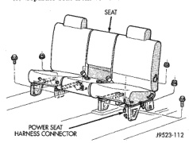

# REMOVAL AND INSTALLATION (Continued)

## SPLIT BENCH SEAT-CONVENTIONAL CAB

### REMOVAL

(1) Move seat track to forward position.

(2) Hinge seat back forward.

(3) Disengage power seat wire connector from body harness, if equipped (Fig. 109).

(4) Remove nuts holding outboard and inboard tracks to floor (Fig. 109).

(5) Move seat track to forward position.

(6) Remove bolt holding inboard seat track to bottom of center occupant seat.

(7) Remove bolts holding front of seat tracks to floor.

(8) Lift center occupant seat upward to clear rear attachment stud.

(9) Separate seat from vehicle.

*Fig. 109 Split Bench Seat]*

### INSTALLATION

(1) Position seat in vehicle.

(2) Install bolts holding front of seat tracks to floor. Tighten the bolts with 28 N·m (250 in. lbs.) torque.

(3) Install bolt holding inboard seat track to bottom of center occupant seat. Tighten the bolt with 28 N·m (250 in. lbs.) torque.

(4) Install nuts holding outboard and inboard tracks to floor. Tighten the nuts with 40 N·m (30 ft. lbs.) torque.

(5) Connect power seat wire connector to body harness, if equipped.

## SPLIT BENCH SEAT-CLUB/QUAD CAB

### REMOVAL

(1) Clamp seat belt to prevent belt from retracting.

(2) Move seats to full rearward position.

(3) Remove bolts attaching front of seat tracks to floor.

(4) Move seats to full forward position.

(5) Remove bolts attaching rear of outboard seat tracks to floor (Fig. 110).

(6) Remove nuts attaching inboard seat tracks to floor.

(7) Disengage power seat wire connector from body harness, if equipped.

(8) Lift seats upward to clear rear studs.

(9) With the aid of a helper, separate seat from vehicle.

*Fig. 110 Split Bench Seat-Club/Quad Cab]*

### INSTALLATION

(1) Position seat in vehicle.

(2) Engage power seat wire connector to body harness, if equipped.

(3) Ensure seats are in full forward position.

(4) Install outboard bolts attaching rear of seat tracks to floor (Fig. 110). Tighten the bolts with 54 N·m (40 ft. lbs.) torque.

(5) Install nuts attaching inboard seat tracks to floor. Tighten the nuts with 40 N·m (30 ft. lbs.) torque.

(6) Move seats to full forward position.

(7) Install bolts attaching front of seat tracks to floor. Tighten the bolts with 54 N·m (40 ft. lbs.) torque.

---
*Source: Chapter 23 Body, Page 59*
