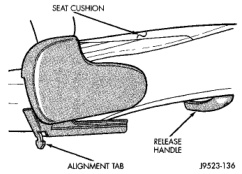
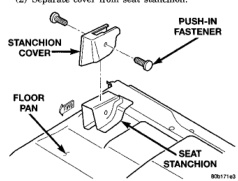
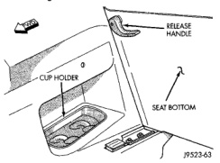

# REMOVAL AND INSTALLATION (Continued)

## CENTER SEAT/CONSOLE

### REMOVAL

(1) Remove bolts on driver and passenger seat inboard seat tracks.

(2) Separate center section.

### INSTALLATION

(1) Position and align center section on driver and passenger seat inboard seat tracks.

(2) Install bolts. Tighten to 19.5 N·m (14 ft. lbs.) torque.

## CONSOLE LID

### REMOVAL

(1) Open console lid.

(2) Using a small flat blade screwdriver, disengage locking tabs located under the console lid trim bezel.

(3) Separate bezel from lid.

(4) Move driver and passenger seat to full forward position.

(5) Using a small drift and hammer, tap out console lid hinge pin.

(6) Separate lid from console.

### INSTALLATION

(1) Align console lid with console. Verify lid tension spring is in position.

(2) Install hinge pin.

(3) Position trim bezel on lid and snap into place.

## STANCHION COVER

### REMOVAL

(1) Remove push-in fasteners attaching stanchion cover to seat stanchion (Fig. 111).

(2) Separate cover from seat stanchion.

*Fig. 111 Stanchion Cover]*

### INSTALLATION

(1) Position cover on seat stanchion.

(2) Install push-in fasteners attaching stanchion cover to seat stanchion (Fig. 111).

## REAR SEAT-CLUB CAB

### REMOVAL

(1) Move front seat track to full forward position.

(2) Turn release handle on underside of rear seat (Fig. 112) to disengage seat cushion and move seat to the stowed position (Fig. 113).

(3) Remove side support bracket screws and lift seat to disengage from cab (Fig. 114).

*Fig. 112 Rear Seat Release Handle]*

*Fig. 113 Rear Seat Stowed]*

### INSTALLATION

(1) Position seat in vehicle.

(2) Align seatback hooks with loops on cab rear panel (Fig. 114).

(3) Align side support alignment tabs, and lower seat into place.

---
*Source: Chapter 23 Body, Page 60*
