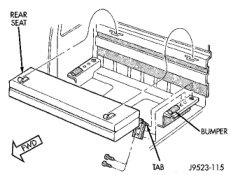
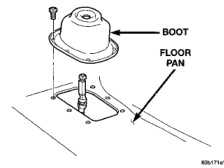
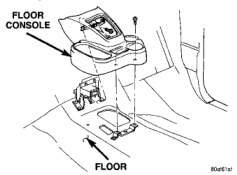

# REMOVAL AND INSTALLATION (Continued)

## REAR SEAT-CLUB CAB (Continued)

### INSTALLATION (Continued)

(4) Install side support bracket screws. Tighten the screws to 28 N·m (250 in. lbs.) torque.

(5) Turn release handle to disengage seat from stowed position and push seat cushion downward to lock into place.

*Fig. 114 Rear Seat Removal/Installation]*

## FLOOR CONSOLE

### REMOVAL

(1) Using a trim stick, pry the corner of the shift boot up and pull boot up to remove from console.

(2) Remove the screws attaching the console to mounting brackets (Fig. 115).

(3) Lift the console upward.

(4) Disengage wire harness connector, if equipped.

(5) Route the shift boot(s) through the console.

(6) Separate console from vehicle.

*Fig. 115 Floor Console]*

### INSTALLATION

(1) Position console in vehicle.

(2) Route the shift boot(s) through the console.

(3) Engage wire harness connector, if equipped.

(4) Position the console on the floor.

(5) Install shift boot on console.

(6) Install the screws attaching the console to mounting brackets (Fig. 115).

## FLOOR SHIFT BOOT-MANUAL TRANSMISSION

### REMOVAL

(1) Pull edge of floor shift boot upward to expose fasteners (Fig. 116).

(2) Remove screws attaching floor shift boot to floor.

(3) Remove gear shift knob.

(4) Separate gear shift boot from floor.

(5) Lift floor shift boot off shifter.

*Fig. 116 Floor Shift Boot-Manual Transmission]*

### INSTALLATION

(1) Position floor shift boot on shifter.

(2) Install gear shift knob.

(3) Install screws attaching floor shift boot to floor.

(4) Tuck edge of floor shift boot to secure.

## 4WD FLOOR SHIFT BOOT-MANUAL TRANSMISSION

### REMOVAL

(1) Pull edge of floor shift boot upward to expose fasteners.

(2) Remove screws attaching floor shift boot to floor.

(3) Remove gear shift knob.

(4) Separate gear shift boot from floor.

(5) Lift floor shift boot off shifter.

### INSTALLATION

(1) Position shift boot on shifter.

(2) Install gear shift knob.

(3) Install screws attaching floor shift boot to floor.

(4) Tuck edge of floor shift boot inward to cover fasteners.

---
*Source: Chapter 23 Body, Page 61*
