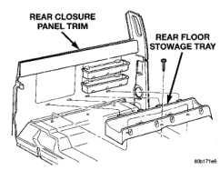
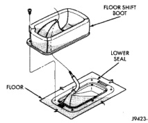
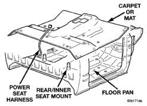

# REMOVAL AND INSTALLATION (Continued)

## 4WD FLOOR SHIFT BOOT-AUTOMATIC TRANSMISSION

### REMOVAL

(1) Pull edge of floor shift boot upward to expose fasteners (Fig. 117).

(2) Remove screws holding floor shift boot to floor.

(3) Remove gear shift knob.

(4) Separate gear shift boot from floor.

(5) Lift floor shift boot off shifter.

### INSTALLATION

Reverse the preceding operation.

*Fig. 117 4WD Floor Shift Boot-Automatic Transmission]*

## REAR FLOOR STOWAGE TRAY

### REMOVAL

(1) Move seat tracks to forward position.

(2) Remove screws holding rear floor stowage tray to floor (Fig. 118).

(3) Disengage hooks on stowage tray from slots in rear closure panel trim.

(4) Separate rear floor stowage tray from vehicle.

*Fig. 118 Rear Floor Stowage Tray]*

### INSTALLATION

Reverse the preceding operation.

## FLOOR CARPET OR MAT

### REMOVAL

(1) Remove seat.

(2) Remove door sill and cowl trim covers.

(3) Remove bolts holding lower seat belt anchors to floor.

(4) Remove floor shift boot, if equipped.

(5) Remove rear stowage tray.

(6) Remove quarter trim panels.

(7) Remove rear closure panel trim.

(8) Fold carpet or mat toward center of cab.

(9) Remove carpet or mat through door opening (Fig. 119).

*Fig. 119 Floor Carpet or Mat]*

### INSTALLATION

(1) Position carpet or mat in vehicle and align all holes (Fig. 119).

(2) Install rear closure panel trim.

(3) Install rear stowage tray.

(4) Install floor shift boot, if equipped.

(5) Install bolts holding lower seat belt anchors to floor.

(6) Install cowl trim covers and door sill.

(7) Install seat.

## FLOOR CARPET OR MAT-CLUB CAB

### REMOVAL

(1) Remove front and rear seats.

(2) Remove door sill and cowl trim covers.

(3) Remove floor shift boot, if equipped.

(4) Remove emergency jack tool kit.

(5) Remove rear seat belt buckles.

---
*Source: Chapter 23 Body, Page 62*
